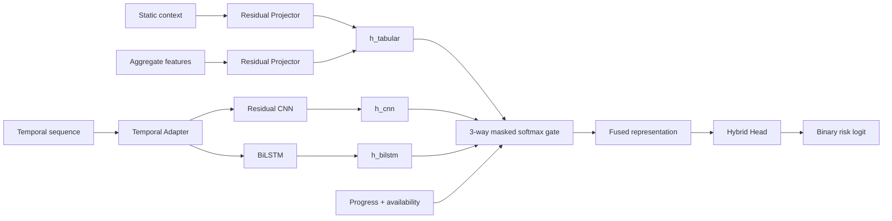

# Dự đoán rủi ro học tập sinh viên bằng Hybrid CNN ∥ BiLSTM

Đây là repository khóa luận xây dựng mô hình **Hybrid** để dự đoán nguy cơ học tập của sinh viên trên hai môi trường dữ liệu khác nhau: **UCI Student Performance** và **OULAD**.

Mô hình chính thức hiện tại là **Phase 4 Hybrid C0**. Hai dataset dùng **cùng một kiến trúc**, nhưng có input dimension, preprocessing và learned weights riêng do bản chất dữ liệu khác nhau.

> **Bài toán chính:** phân loại nhị phân sinh viên có nguy cơ học tập (`risk`) hay không (`non-risk`) tại nhiều mức thông tin khác nhau.
>
> **Evaluation authority:** Phase 4 robust inner `3 folds × 3 seeds`. Outer test chưa được mở.

---

## 1. Bài toán dự đoán

### UCI Student Performance

Target được xây dựng từ điểm cuối kỳ `G3`:

```text
G3 < 10  → Risk
G3 ≥ 10  → Non-risk
```

Một fitted Hybrid được quan sát tại ba trạng thái thông tin:

| Trạng thái | Thông tin học tập khả dụng |
|---|---|
| `S0` | Chưa có `G1`, `G2` |
| `S1` | Có `G1` |
| `S2` | Có `G1` và `G2` |

`G3` chỉ dùng để tạo nhãn, **không bao giờ là predictor**.

### OULAD

Target được xây dựng từ `final_result`:

```text
Fail / Withdrawn      → Risk
Pass / Distinction    → Non-risk
```

Một fitted Hybrid được đánh giá theo tiến trình môn học:

```text
20% → 35% → 50% → 75% → 100%
```

Mỗi cutoff chỉ sử dụng sự kiện thỏa:

```text
observation_start ≤ event_time < cutoff
```

`final_result`, `score`, `target` và `date_unregistration` không được dùng làm predictor.

---

## 2. Dataset và attributes

## 2.1. UCI Student Performance

Repository sử dụng hai tập UCI gốc và gộp thành một môi trường UCI Combined:

| Dataset | Số bản ghi |
|---|---:|
| Student Mathematics (`student-mat.csv`) | 395 |
| Student Portuguese (`student-por.csv`) | 649 |
| **Tổng course records** | **1,044** |

Các sinh viên xuất hiện ở cả hai môn được group theo quasi-identity để tránh cùng một sinh viên rơi vào hai phía của split.

### Nhóm attributes gốc

| Nhóm | Attributes |
|---|---|
| Nhân khẩu / trường học | `school`, `sex`, `age`, `address`, `famsize`, `Pstatus` |
| Gia đình | `Medu`, `Fedu`, `Mjob`, `Fjob`, `guardian`, `famrel` |
| Lý do và hỗ trợ học tập | `reason`, `schoolsup`, `famsup`, `paid`, `activities`, `nursery`, `higher`, `internet` |
| Hành vi / điều kiện học tập | `traveltime`, `studytime`, `failures`, `freetime`, `goout`, `Dalc`, `Walc`, `health`, `romantic` |
| Chuyên cần | `absences` |
| Điểm theo giai đoạn | `G1`, `G2`, `G3` |
| Thuộc tính bổ sung khi gộp | `subject` = `math` / `portuguese` |

Trong mô hình final, static context sử dụng các thuộc tính hợp lệ ở trên nhưng loại `G1`, `G2`, `G3`, `absences` khỏi static predictor. `G1/G2` chỉ đi vào nhánh theo thời gian khi trạng thái thông tin cho phép.

---

## 2.2. OULAD

OULAD đại diện cho môi trường học tập trực tuyến có dữ liệu hành vi theo thời gian. Pipeline active đọc các bảng raw chính:

```text
courses.csv
studentInfo.csv
studentRegistration.csv
vle.csv
studentVle.csv
assessments.csv
studentAssessment.csv
```

### Static/context attributes

**Categorical**

```text
gender
region
highest_education
imd_band
age_band
disability
code_module
presentation_season
```

**Numeric**

```text
num_of_prev_attempts
studied_credits
registration_lead_time
module_presentation_length
```

Các context feature được fit/transform bằng **FIT-only preprocessing**; vocabulary và scaling statistics không được học từ validation/test.

---

## 3. Đặc trưng được xây dựng

## 3.1. UCI

UCI có chuỗi điểm rất ngắn nên feature builder giữ đúng ý nghĩa theo trạng thái thông tin.

| State | Temporal | Aggregate được xây dựng |
|---|---|---|
| `S0` | Không có điểm theo thời gian | Aggregate chưa khả dụng |
| `S1` | `G1 / 20` | điểm gần nhất, running mean, progress |
| `S2` | `G1 / 20 → G2 / 20` | điểm gần nhất, running mean, progress, biến thiên `G2-G1`, indicator đủ hai mốc |

Nhánh static chứa context cá nhân/gia đình/học tập; nhánh temporal chỉ nhận điểm đã được phép xuất hiện ở state hiện tại.

---

## 3.2. OULAD

OULAD được biểu diễn bằng ba nhóm feature: **static**, **temporal** và **aggregate**.

### 11 temporal channels theo tuần

```text
activity_intensity_log1p
active_days
unique_sites
unique_activity_types
content_activity
forum_activity
quiz_activity
assessment_related_activity
weekly_submissions
weekly_late_submissions
week_exposure_fraction
```

Các channel được tạo từ hoạt động VLE và submission trước cutoff. Pipeline còn chuẩn hóa theo exposure để giảm sai lệch do tuần quan sát không đầy đủ.

### 13 aggregate channels

```text
cumulative_activity
mean_weekly_activity
recent_activity
recent_historical_activity_ratio
activity_trend
current_inactivity_streak
cumulative_inactive_weeks
days_since_last_activity
assessments_due_to_date
submitted_due_to_date
completion_rate
missed_due_count
late_submission_rate
```

Nhóm này mô tả mức độ hoạt động tích lũy, xu hướng gần đây, chuỗi không hoạt động và tiến độ nộp assessment tại đúng thời điểm cutoff.

### Quy tắc chống leakage

```text
Chỉ dùng event trước cutoff
Không dùng final_result làm predictor
Không dùng score làm predictor
Không dùng date_unregistration làm predictor
Assessment chỉ được tính khi deadline đã xuất hiện trước cutoff
Scaler / encoder chỉ fit trên FIT partition
```

---

## 4. Kiến trúc Hybrid C0

Hybrid final **không phải CNN → BiLSTM nối tiếp**. CNN và BiLSTM xử lý cùng biểu diễn temporal theo **hai nhánh song song**, sau đó được hợp nhất với nhánh tabular bằng gated fusion.



### Thành phần chính

| Thành phần | Vai trò |
|---|---|
| Static projector | Biến đổi context tĩnh sang không gian biểu diễn chung |
| Aggregate projector | Biểu diễn các đặc trưng tổng hợp tại cutoff |
| Temporal adapter | Chuẩn hóa đầu vào chuỗi trước hai expert temporal |
| Residual CNN | Học pattern cục bộ trong chuỗi |
| BiLSTM | Học quan hệ hai chiều trong chuỗi quan sát |
| 3-way masked softmax gate | Tự điều chỉnh trọng số giữa tabular / CNN / BiLSTM theo availability và progress |
| Hybrid head | Sinh một binary risk logit |

Shared structural configuration:

```text
architecture_id = C0
d_fuse         = 128
cnn_channels   = 64
bilstm_hidden  = 128
fusion         = 3-way masked softmax
```

Availability của hai temporal experts được điều khiển bởi `temporal_available`; nếu chưa có chuỗi như UCI `S0`, CNN/BiLSTM không được nhận trọng số giả.

---

## 5. Best observed by stage

Các bảng dưới đây lấy **best observed PR-AUC của từng stage trong evidence Phase 4 robust 3×3**. `Accuracy`, `F1` và `Recall` được lấy từ **chính cùng run đã đạt PR-AUC tốt nhất tại stage đó**.

> Đây là **best-case / best observed view**, không phải trung bình robust. Các stage có thể đến từ fold/seed khác nhau và không được diễn giải là một single checkpoint duy nhất. Báo cáo robust mean vẫn được giữ trong `reports/prediction/final/FINAL_PREDICTION_MODEL_REPORT.md`.

### UCI — best observed by stage

| State | PR-AUC | Accuracy | F1 | Recall | Fold | Seed | Best epoch |
|---|---:|---:|---:|---:|---:|---:|---:|
| `S0` | **0.5124** | 0.4234 | 0.4104 | **0.9649** | 2 | 42 | 7 |
| `S1` | **0.8530** | 0.8787 | 0.7027 | 0.6610 | 1 | 2026 | 19 |
| `S2` | **0.9417** | **0.9412** | **0.8571** | 0.8136 | 1 | 2026 | 19 |

Ở trạng thái đầy đủ `S2`, Hybrid đạt best observed:

```text
PR-AUC   = 94.17%
Accuracy = 94.12%
F1       = 85.71%
Recall   = 81.36%
```

### OULAD — best observed by stage

| State | PR-AUC | Accuracy | F1 | Recall | Fold | Seed | Best epoch |
|---|---:|---:|---:|---:|---:|---:|---:|
| `20%` | **0.7707** | 0.6689 | 0.6811 | **0.8254** | 0 | 2026 | 37 |
| `35%` | **0.8119** | 0.7551 | 0.7038 | 0.7165 | 0 | 42 | 25 |
| `50%` | **0.8594** | 0.8059 | 0.7421 | 0.7290 | 0 | 1201 | 30 |
| `75%` | **0.8993** | 0.8766 | 0.7974 | 0.7080 | 0 | 1201 | 30 |
| `100%` | **0.9297** | **0.9098** | **0.8508** | 0.7890 | 0 | 2026 | 37 |

Best observed cho thấy hiệu năng tăng dần khi lượng thông tin tăng. Riêng `100%` phải đọc cùng caveat đã khóa trong project: độ dài lịch sử quan sát có liên hệ mạnh với nhóm `Withdrawn`, vì vậy endpoint này không được xem là một academic-risk endpoint hoàn toàn sạch khỏi confounding.

---

## 6. Robust results và active baselines

Best observed được dùng để mô tả **khả năng tốt nhất đã quan sát được**; kết luận về độ ổn định vẫn dựa trên robust `3 folds × 3 seeds`.

Active comparator roster:

```text
Logistic Regression
Decision Tree
Random Forest
SVM
MLP
```

XGBoost chỉ còn trong historical/research evidence và không thuộc active comparator roster của Phase 4 final.

Canonical robust report:

```text
reports/prediction/final/FINAL_PREDICTION_MODEL_REPORT.md
```

Canonical result tables:

```text
reports/prediction/final/uci_final.csv
reports/prediction/final/oulad_final.csv
```

---

## 7. Source chính

| Thành phần | Path |
|---|---|
| Hybrid model | `src/prediction/model/hybrid.py` |
| UCI data adapter | `src/prediction/data/uci.py` |
| OULAD data contract | `src/prediction/data/oulad.py` |
| OULAD feature builder | `src/prediction/data/oulad_features.py` |
| Final config | `configs/prediction/hybrid_final.json` |
| Final report | `reports/prediction/final/FINAL_PREDICTION_MODEL_REPORT.md` |
| Final audits | `artifacts/prediction/final/` |

Validation commands:

```powershell
python project.py prediction status
python project.py prediction registry
python project.py prediction validate
pytest tests/prediction -q
```

---

## 8. Final authority

```text
Model            : Hybrid
Architecture     : C0
UCI states       : S0 / S1 / S2
OULAD states     : 20 / 35 / 50 / 75 / 100
Outer test used  : false
Final authority  : Phase 4
```

Một kiến trúc Hybrid được giữ thống nhất giữa hai dataset; khác biệt chỉ nằm ở input representation, FIT-only preprocessing và learned weights phù hợp với từng môi trường dữ liệu.
