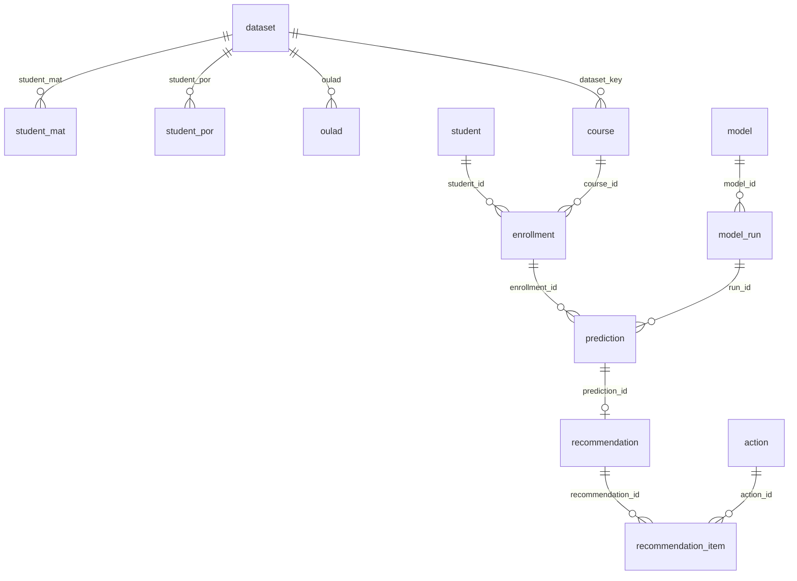

# Live PostgreSQL (`student_db`)

One chain, matching the thesis workflow:

**raw (3 datasets) → catalog (identity) → prediction (Hybrid C0) → recommendation (V3)**



| Schema | Role |
|---|---|
| `raw` | Three source datasets only: `student_mat`, `student_por`, `oulad` |
| `catalog` | Unified student–course enrollment (UCI + OULAD identities) |
| `prediction` | Hybrid C0 OOF risk (OULAD stages 20/35/50/75) |
| `recommendation` | Five-EBM-C0 ranked actions |

`raw.dataset` is the join root: both UCI tables and OULAD hang off it, and `catalog.course.dataset_key` points at the same row. That is why raw is no longer an island.

OULAD is **one** landing table (`raw.oulad`) because it is one dataset. The original 7 CSVs are `source_file` + `payload` (courses, assessments, vle, studentInfo, studentRegistration, studentAssessment, studentVle). UCI is typed columns because each file is already one table.

C0 / V3 rows attach to OULAD enrollments only. UCI enrollments exist in `catalog` for identity; they have no V3 recommendations.

## Commands

```powershell
python project.py db status
python project.py db migrate-raw
python project.py db load-raw
python project.py db load-predictions
python project.py db load-recommendations
python project.py db load-all
```

Connection comes from `.env` (`DB_HOST`, `DB_PORT`, `DB_NAME`, `DB_USER`, `DB_PASSWORD`).
Raw CSVs are read from `RAW_DATA_DIR` or `C:\hufit\kltn\data\raw`, then copied into `data/raw/` (gitignored).
