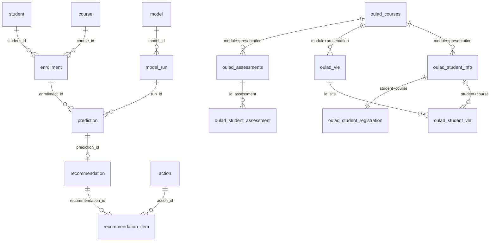

# Live PostgreSQL (`student_db`)

This is the running application database on localhost.

Unused leftover objects were dropped (`database/live/002_prune_unused.sql`):
empty `audit` log schema, V2 recommendation freeze tables, derived `data.*`
feature copies, and old `student_predict*` test/restore databases.

Relationships are in `database/live/003_add_relationships.sql`.
Refresh the pgAdmin ERD after that migration — it previously looked messy
because raw tables had no keys and prediction/recommendation were not
linked to catalog.



Two clusters is intentional: serving tables (`catalog` / `prediction` / `recommendation`)
and OULAD landing (`raw.oulad_*`). `raw.uci_mat`, `raw.uci_por`, and
`raw.load_manifest` stay unlinked — JSON dumps and a loader log.

## What is stored

| Layer | Tables | Content |
|---|---|---|
| Raw CSVs | `raw.uci_*`, `raw.oulad_*` | Full UCI + OULAD source files, including `studentVle` |
| Catalog | `catalog.student/course/enrollment` | Student–course identities |
| Prediction | `prediction.model`, `model_run`, `prediction` | Hybrid C0 OOF probabilities (66,685 rows) |
| Recommendation V3 | `recommendation.action`, `recommendation`, `recommendation_item` | Five-EBM-C0 ranked actions |

## Commands

```powershell
python project.py db status
python project.py db migrate-raw
python project.py db load-raw
python project.py db load-predictions
python project.py db load-recommendations
python project.py db load-all
```

Connection comes from `.env` (`DB_HOST`, `DB_PORT`, `DB_NAME`, `DB_USER`, `DB_PASSWORD`).
Raw CSVs are read from `RAW_DATA_DIR` or `C:\hufit\kltn\data\raw`, then copied into `data/raw/` (gitignored).
