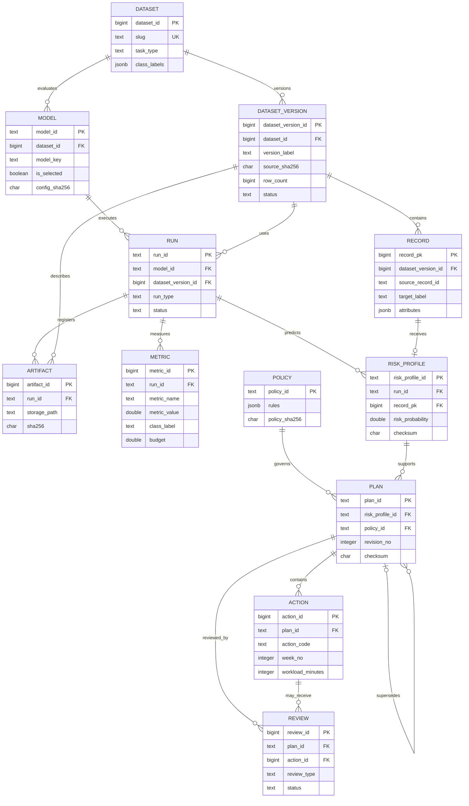

# Database ERD

```mermaid
erDiagram
    DATASET ||--o{ DATASET_VERSION : versions
    DATASET_VERSION ||--o{ RECORD : contains
    DATASET ||--o{ MODEL : evaluates
    MODEL ||--o{ RUN : executes
    DATASET_VERSION ||--o{ RUN : uses
    RUN ||--o{ ARTIFACT : registers
    DATASET_VERSION ||--o{ ARTIFACT : describes
    RUN ||--o{ METRIC : measures
    RUN ||--o{ RISK_PROFILE : predicts
    RECORD ||--o| RISK_PROFILE : receives
    POLICY ||--o{ PLAN : governs
    RISK_PROFILE ||--o{ PLAN : supports
    PLAN ||--o{ ACTION : contains
    PLAN ||--o{ REVIEW : reviewed_by
    ACTION ||--o{ REVIEW : may_receive
    PLAN o|--o{ PLAN : supersedes

    DATASET {
      bigint dataset_id PK
      text slug UK
      text task_type
      jsonb class_labels
    }
    DATASET_VERSION {
      bigint dataset_version_id PK
      bigint dataset_id FK
      text version_label
      char source_sha256
      bigint row_count
      text status
    }
    RECORD {
      bigint record_pk PK
      bigint dataset_version_id FK
      text source_record_id
      text target_label
      jsonb attributes
    }
    MODEL {
      text model_id PK
      bigint dataset_id FK
      text model_key
      boolean is_selected
      char config_sha256
    }
    RUN {
      text run_id PK
      text model_id FK
      bigint dataset_version_id FK
      text run_type
      text status
    }
    ARTIFACT {
      bigint artifact_id PK
      text run_id FK
      text storage_path
      char sha256
    }
    METRIC {
      bigint metric_id PK
      text run_id FK
      text metric_name
      double metric_value
      text class_label
      double budget
    }
    POLICY {
      text policy_id PK
      jsonb rules
      char policy_sha256
    }
    RISK_PROFILE {
      text risk_profile_id PK
      text run_id FK
      bigint record_pk FK
      double risk_probability
      char checksum
    }
    PLAN {
      text plan_id PK
      text risk_profile_id FK
      text policy_id FK
      integer revision_no
      char checksum
    }
    ACTION {
      bigint action_id PK
      text plan_id FK
      text action_code
      integer week_no
      integer workload_minutes
    }
    REVIEW {
      bigint review_id PK
      text plan_id FK
      bigint action_id FK
      text review_type
      text status
    }
```

`system.schema_migration` is deliberately omitted from the domain diagram; it
is the checksummed control-plane ledger.
