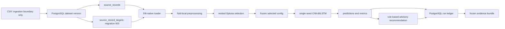

# Final system architecture

CSV is only an ingestion source. Final/model-selection code uses the PostgreSQL
loader by dataset version and source-record lineage. Migration 003 implements
separate target storage but remains live-manual-pending; the diagram describes
the final source architecture, not a claim that live migration is complete.
