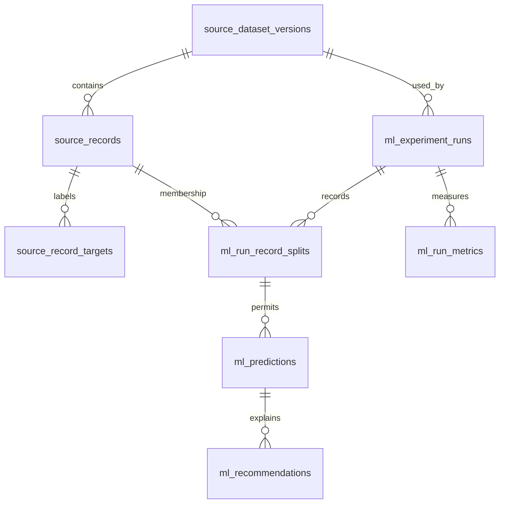

# PostgreSQL lineage

`student_predict` is the canonical source architecture. Dataset versions carry
content and ingestion-contract hashes; record, split, prediction, metric and
recommendation linkage supplies lineage. Migration 003 defines separate target
storage keyed by dataset version and record. Source code is complete, but live
migration, 395-row target backfill and credentialed integration tests are complete.
