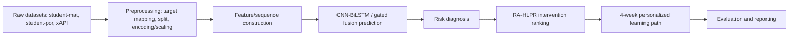

# 00. Project Context For LLM

Tài liệu này là context bàn giao kỹ thuật cho LLM viết báo cáo khóa luận. Mọi thông tin được phân loại theo ba mức:

- `VERIFIED`: có source code, artifact final, checkpoint metadata, output CSV/JSON, test log hoặc git evidence trong repository hiện tại.
- `INFERRED`: suy ra hợp lý từ code/artifact nhưng thiếu raw output hoặc metadata trực tiếp.
- `MISSING`: chưa đủ dữ kiện, không được viết như sự thật trong khóa luận.

## 1. Project Identity

- Repository đang phân tích: `C:\Huflit\kltn`, remote `https://github.com/Phucht59/prediction_student.git` (`git remote -v`).
- Branch hiện tại: `main` (`git branch --show-current`).
- Commit gần nhất: `400ded3 Clean final thesis project structure and reports` (`git log --oneline -5`, `git show --stat --oneline -1`).
- Working tree có sẵn file chưa track trước khi tạo context: `reports/final/KLTN_BAO_CAO_THEO_MAU_2026.docx`, `reports/final/figures/`, `scripts/build_klt_report_docx.py` (`git status --short`). Các file này không bị chỉnh sửa.
- Source chính: `src/`, `scripts/`, `tests/`, `reports/final/`, `outputs/recommender/`, `models/`, `data/recommender/`.

## 2. Tên Đề Tài Thực Tế

Tên đề tài dự kiến phù hợp với nội dung repo:

**XÂY DỰNG MÔ HÌNH HỌC KẾT HỢP ĐỂ DỰ ĐOÁN THÀNH TÍCH HỌC TẬP SINH VIÊN VÀ ĐỀ XUẤT LỘ TRÌNH HỌC TẬP CÁ NHÂN HÓA**

Trạng thái: `VERIFIED` về hướng đề tài qua `README.md`, `reports/final/FINAL_PROJECT_STATUS.md`, `reports/final/final_recommender_report.md`. Cụm "học kết hợp" trong repo được hiện thực chủ yếu dưới dạng CNN-BiLSTM kết hợp nhánh context/gated fusion và module downstream RA-HLPR; không có bằng chứng collaborative filtering.

## 3. Bối Cảnh Và Vấn Đề Nghiên Cứu

Repo triển khai bài toán dự đoán thành tích học tập sinh viên theo ba mức `Low`, `Medium`, `High`, sau đó dùng xác suất dự đoán để sinh khuyến nghị/lộ trình học tập 4 tuần. Bối cảnh nghiên cứu hợp lệ là khai phá dữ liệu giáo dục cho phát hiện sớm nhóm có nguy cơ học tập thấp và chuyển kết quả dự đoán thành can thiệp vận hành.

Không được viết rằng hệ thống đã chứng minh cải thiện thành tích thật sau can thiệp, vì `reports/final/final_recommender_report.md` và `reports/final/final_recommender_thesis_summary_vi.md` xác nhận recommender chỉ được đánh giá offline theo weak-supervision/rule-based reference, chưa có feedback thật.

## 4. Mục Tiêu Tổng Quát

Xây dựng pipeline dự đoán mức thành tích học tập `Low/Medium/High` bằng mô hình CNN-BiLSTM/gated fusion và xây dựng module RA-HLPR để chuyển xác suất dự đoán thành chẩn đoán rủi ro, xếp hạng can thiệp và lộ trình học tập cá nhân hóa 4 tuần.

Trạng thái: `VERIFIED` từ `README.md`, `src/data_pipeline.py`, `src/models/models.py`, `src/models_v27.py`, `scripts/run_recommender_pipeline.py`, `reports/final/final_recommender_report.md`.

## 5. Mục Tiêu Cụ Thể

1. Chuẩn hóa nhãn 3 lớp cho Student datasets từ `G3` và cho xAPI từ `Class`.
2. Xây dựng pipeline preprocessing gồm split train pool/locked test, feature engineering, encoding/scaling, feature selection và sequence construction.
3. Huấn luyện/đánh giá mô hình CNN-BiLSTM hoặc gated fusion theo dataset/scenario.
4. So sánh với baseline machine learning như đối chứng, không dùng baseline để distillation, pseudo-label hoặc teacher model.
5. Tạo RA-HLPR gồm risk diagnosis, candidate filtering, hybrid scoring và path planning.
6. Đánh giá mô hình dự đoán bằng Macro F1, Recall Low, F1 Low; đánh giá recommender offline bằng risk F1, Precision@3, Recall@3, NDCG@3, coverage và path quality.

## 6. Câu Hỏi Nghiên Cứu

- Mô hình CNN-BiLSTM có dự đoán được ba mức thành tích học tập `Low/Medium/High` trên Student datasets và xAPI không?
- Kịch bản dữ liệu `midterm` và `late` ảnh hưởng thế nào đến khả năng nhận diện lớp Low?
- Với xAPI, gated fusion có phù hợp hơn sequence-only thuần túy khi dữ liệu có cả hành vi sequence và context/categorical không?
- Khi ưu tiên nhóm rủi ro, việc tune threshold cho lớp Low theo OOF probabilities cải thiện Recall/F1 Low ra sao?
- RA-HLPR có thể chuyển xác suất dự đoán và tín hiệu quan sát được thành lộ trình học tập 4 tuần có giải thích không?

## 7. Phạm Vi Nghiên Cứu

Phạm vi được xác minh:

- Datasets chính theo repo: `student-mat`, `student-por`, `xapi` (`src/config.py`, `README.md`).
- Không dùng `student-combine` làm dataset chính (`README.md`, `CLEANUP_LOG.md`, archive experiment source).
- Bài toán chính là classification 3 lớp. Không có final regression result được claim (`reports/final/final_prediction_model_report.md`).
- Recommender là downstream rule-aware/prediction-aware, không phải collaborative filtering (`reports/final/final_recommender_report.md`).
- Locked test chỉ dùng final evaluation; threshold Low tune bằng CV/OOF probabilities theo final report và archive experiment code.

Giới hạn phạm vi:

- Raw datasets không được track trong repo (`data/raw/.gitkeep`, `.gitignore`, `CLEANUP_LOG.md`).
- `models/saved/final/` tồn tại nhưng trống trong workspace hiện tại; pipeline rerun final/recommender thiếu best params và seed checkpoints.
- `models/final/final_model_manifest.json` mô tả strict-validation v23 khác với quyết định final trong `reports/final/`; không dùng file này làm kết quả final chính nếu không có quyết định mới.

## 8. Đóng Góp Nghiên Cứu

`VERIFIED/PARTIAL`:

- Pipeline dự đoán 3 lớp với CNN-BiLSTM và gated fusion cho xAPI.
- Thiết kế đánh giá chú trọng Macro F1, Recall Low, F1 Low thay vì Accuracy đơn thuần.
- Guardrail chống leakage: `G3_raw` bị loại khỏi feature, scenario Student drop grade không sẵn có trước feature engineering, weak labels của RA-HLPR không dùng true `G3`/`Class`.
- So sánh baseline chỉ để đối chứng; xAPI RandomForest baseline có Macro F1 cao hơn deep final.
- RA-HLPR chuyển xác suất dự đoán thành chẩn đoán rủi ro và lộ trình 4 tuần có giải thích.

Không được claim:

- Deep learning thắng baseline ở mọi dataset.
- Regression head là đóng góp chính/final result.
- Recommender cải thiện nhân quả kết quả học tập.
- Có user feedback hoặc online A/B test.
- Có statistical significance test hoặc ablation final đầy đủ nếu không bổ sung artifact.

## 9. Đóng Góp Hệ Thống

`VERIFIED`:

- `src/data_pipeline.py`: split dữ liệu, xử lý target, feature engineering, preprocessing, oversampling, sequence construction.
- `src/models/models.py`: CNN-BiLSTM + context MLP + classifier.
- `src/models_v27.py`: Attention pooling, `GatedFusion`, `StudentHybridV27` với class/ordinal/reg heads.
- `scripts/run_pipeline.py`: pipeline train/evaluate, ensemble seeds, lưu metrics/predictions/learning paths.
- `scripts/run_recommender_pipeline.py`: RA-HLPR final pipeline.
- `src/recommender/*`: risk rules, risk head, candidate generator, hybrid scorer, path planner, knowledge base.
- `tests/`: 31 tests pass với `py -3.10 -m pytest -q`.

## 10. Dataset Và Pipeline Dữ Liệu

### Dataset Config

- `src/config.py`: `student-mat` dùng `student-mat.csv`, target `G3`, separator `;`; `student-por` tương tự; `xapi` dùng `xAPI-Edu-Data.csv`, target `Class`, separator `,`.
- `STUDENT_G3_3CLASS_BINS = [0, 9, 14, 20]`; `pd.cut(..., labels=[0,1,2], include_lowest=True)`. Diễn giải: Low `[0,9]`, Medium `(9,14]`, High `(14,20]`.
- `XAPI_CLASS_MAPPING = {"L": 0, "M": 1, "H": 2}`.

### Split

- `src/data_pipeline.py:create_and_save_locked_test`: train pool 80%, locked test 20%, stratify theo `_strat_target`, `random_state=DEFAULT_SEED=42`.
- `LOCKED_TEST_SIZE = 0.2`, `CV_FOLDS = 5`.
- `CLEANUP_LOG.md` ghi raw CSV và processed final không track trong Git.

### Feature Engineering

- Student: `grade_growth`, `grade_avg`, `absence_study_ratio`, `failure_risk`, `alcohol_risk`, `social_risk`.
- xAPI: `engagement_score`, `absence_risk`, `parent_support_signal`, `hands_resource_ratio`, `active_participation`, `resource_engagement_ratio`.
- Sequence columns hiện tại: Student `["G1", "G2"]`, xAPI `["raisedhands", "VisITedResources", "AnnouncementsView", "Discussion"]`.

### Scenario

Scenario Student lấy từ archive experiment source:

- `early`: drop `G1`, `G2`; không có sequence thật.
- `midterm`: drop `G2`; sequence `["G1"]`.
- `late`: giữ `G1`, `G2`; sequence `["G1","G2"]`.
- `apply_student_scenario` chạy feature engineering sau khi drop grade chưa sẵn có để tránh derived features smuggle `G1/G2`.

xAPI dùng scenario `default` theo artifact final, không có scenario drop trong source current.

## 11. Kiến Trúc Hệ Thống Tổng Thể



Dashboard thật không được xác minh trong source/artifact hiện tại; không đưa dashboard vào sơ đồ.

## 12. Mô Hình CNN-BiLSTM

### Source hiện tại

`src/models/models.py:StudentHybridModel`:

- Input sequence shape theo `StudentDataset`: `(batch, seq_len, 1)`.
- `Conv1d(in_channels=1, out_channels=cnn_channels, kernel_size=cnn_kernel_size, padding=...)`.
- `BatchNorm1d`, `ReLU`, `Dropout`.
- `LSTM(input_size=cnn_channels, hidden_size=lstm_hidden_dim, batch_first=True, bidirectional=True)`.
- Attention pooling qua `AttentionPooling1D`.
- Context branch: categorical embeddings + numerical features qua MLP hai Linear.
- Fusion: concat sequence vector và context vector, Linear/ReLU/Dropout, classifier.

### Sequence-only final Student

Tên final trong `reports/final/FINAL_PROJECT_STATUS.md`: `sequence_cnn_bilstm_only` cho `student-mat late`, `student-por late`, `student-por midterm`.

`archive/experiments/.../deep_debug.py:SequenceCNNBiLSTMOnly`:

- Conv1d `1 -> cnn_channels`, kernel 3, padding 1.
- BatchNorm1d, ReLU, Dropout.
- BiLSTM hidden mặc định `hidden_dim=64`, bidirectional.
- Attention pooling.
- Output heads: class, ordinal, reg. Nhưng regression head không được claim final.

Trạng thái: metrics final Student là `PARTIALLY VERIFIED`; có trong final status summary, nhưng không tìm thấy CSV per-run/manifest/checkpoint 3-class tương ứng.

## 13. Gated Fusion

`src/models_v27.py:GatedFusion`:

```text
h_seq = Linear(seq_vec)
h_ctx = Linear(ctx_vec)
gate = sigmoid(Linear([seq_vec, ctx_vec]))
fused = gate * h_seq + (1 - gate) * h_ctx
```

`reports/final/final_model_manifest.json` và `reports/final/final_prediction_model_report.md` chốt xAPI final là `gated_fusion_v28` với kiến trúc "CNN-BiLSTM with gated context fusion".

Trạng thái:

- `VERIFIED`: tên final xAPI, metric final xAPI, mô tả gated context fusion.
- `PARTIALLY VERIFIED`: cấu trúc code gated fusion có trong `StudentHybridV27`.
- `MISSING`: không tìm thấy file/class/source exact tên `gated_fusion_v28`; checkpoint path exact cho v28 không có trong manifest.

## 14. Baseline Đối Chứng

`reports/final/final_baseline_comparison.csv` chỉ có baseline final cho xAPI:

- Deep xAPI: `gated_fusion_v28`, Macro F1 `0.7541`, Recall Low `0.8846`, F1 Low `0.8214`.
- Baseline xAPI: `RandomForestClassifier`, Macro F1 `0.8465`, Recall Low/F1 Low `not_available`, usage note: comparison only.

Archive baseline suite (`archive/experiments/.../baselines.py`) có LogisticRegression, RandomForestClassifier, gradient boosting fallback/XGBoost/CatBoost/HistGradientBoosting, MLPClassifier, nhưng final artifact chỉ giữ xAPI RandomForest comparison.

## 15. RA-HLPR

Tên đầy đủ theo report: **Risk-Aware Hybrid Learning Path Recommender**.

Pipeline final trong `scripts/run_recommender_pipeline.py`:

1. Load train pool và locked test.
2. Generate ensemble class probabilities.
3. Generate weak labels bằng `src/recommender/risk_rules.py`.
4. Extract compact features bằng `src/recommendation.py:extract_features`.
5. Train `RiskDiagnosisHead` MLP với BCEWithLogitsLoss, pos_weight.
6. Predict risk probabilities trên locked test.
7. Load intervention catalog từ `data/recommender/intervention_catalog.csv`.
8. `CandidateGenerator` lọc intervention theo dataset/risk/predicted class.
9. `HybridScorer` xếp hạng can thiệp theo công thức weighted score.
10. `PathPlanner` tạo lộ trình 4 tuần.
11. Evaluate offline và lưu output CSV/JSON/MD.

Recommender final:

- `xapi`: refreshed final output có trong `outputs/recommender/xapi`.
- `student-por`: refreshed final output có trong `outputs/recommender/student-por`.
- `student-mat`: pending refreshed full run do thiếu metadata checkpoint `models/saved/final/student-mat_3class_ensemble_features.json`.

Không phải collaborative filtering: không có user-user/item-item similarity, matrix factorization, implicit feedback hoặc user-item history trong source final.

## 16. Thiết Kế Thực Nghiệm

### Prediction

- Split locked test: 20%, stratified, seed 42 (`src/data_pipeline.py`).
- CV/OFF threshold: archive experiment code tune threshold từ OOF probabilities trên train pool, không dùng locked test.
- Metrics: Accuracy, Macro Precision, Macro Recall, Macro F1, Recall Low, F1 Low, RMSE/R2 class-to-point trong archive common; final report tập trung Macro F1, Recall Low, F1 Low.
- Không tìm thấy statistical test final.
- Không tìm thấy confusion matrix final numeric artifact.
- Không tìm thấy ROC/AUC final artifact.

### Recommender

- Offline evaluation so với weak-supervision/rule-based reference.
- Metrics: risk micro/macro F1, precision/recall, hamming loss, Precision@3, Recall@3, NDCG@3, Coverage@3, risk coverage, workload std, difficulty progression, prerequisite violation.

## 17. Kết Quả Đã Xác Minh

### Final Prediction Rows

| Dataset | Scenario | Model | Prediction mode | Macro F1 | Recall Low | F1 Low | Status |
|---|---|---|---|---:|---:|---:|---|
| student-mat | late | sequence_cnn_bilstm_only | low_f1_tuned | 0.9365 | 0.9615 | 0.8929 | Partially verified |
| student-por | late | sequence_cnn_bilstm_only | low_f1_tuned | 0.8783 | 0.9000 | 0.8182 | Partially verified |
| student-por | midterm | sequence_cnn_bilstm_only | argmax | 0.8228 | 0.6500 | 0.7429 | Partially verified |
| xAPI | default | gated_fusion_v28 | low_f1_tuned | 0.7541 | 0.8846 | 0.8214 | Verified |

Evidence:

- Student rows: `reports/final/FINAL_PROJECT_STATUS.md`, `README.md`, `CLEANUP_LOG.md`, `scripts/build_klt_report_docx.py`; thiếu per-run CSV/manifest riêng.
- xAPI row: `reports/final/final_model_manifest.json`, `reports/final/final_deep_results_table.csv`, `reports/final/final_baseline_comparison.csv`, `reports/final/final_prediction_model_report.md`, `reports/final/FINAL_PROJECT_STATUS.md`.

### Final Recommender Metrics

| Dataset | Risk Macro F1 | Risk Micro F1 | Precision@3 | Recall@3 | NDCG@3 | Coverage@3 | Risk Coverage |
|---|---:|---:|---:|---:|---:|---:|---:|
| xapi | 0.9831 | 0.9813 | 0.6840 | 0.4720 | 0.8229 | 0.6500 | 0.8958 |
| student-por | 0.9359 | 0.9094 | 0.6641 | 0.3185 | 0.7455 | 0.5500 | 0.9508 |

Evidence: `outputs/recommender/xapi/recommender_metrics.json`, `outputs/recommender/student-por/recommender_metrics.json`, `reports/final/final_recommender_report.md`.

## 18. Diễn Giải Kết Quả

- Student late scenarios có metric cao hơn student-por midterm, phù hợp với việc late có cả `G1` và `G2`, còn midterm chỉ dùng `G1`. Đây là diễn giải hợp lý từ scenario code, không nên biến thành kết luận nhân quả mạnh.
- xAPI deep final có Recall Low cao nhưng Macro F1 thấp hơn RandomForest baseline. Vì vậy phải viết thận trọng: deep model hữu ích khi ưu tiên phát hiện Low, nhưng không vượt baseline về Macro F1.
- `low_f1_tuned` có mục tiêu tối ưu F1 Low trên threshold sweep từ OOF probabilities trong archive code; không tune bằng locked test theo final report.
- RA-HLPR metric cao ở risk diagnosis chủ yếu đo khả năng tái hiện weak rules, không đo cải thiện học tập thật.

## 19. Hạn Chế Thật Sự

- Raw datasets và processed splits không có trong repo hiện tại.
- `models/saved/final/` trống, thiếu best params/seed checkpoints mà `scripts/run_pipeline.py` và `scripts/run_recommender_pipeline.py` kỳ vọng.
- Student final 3-class result chỉ có summary final, chưa tìm thấy per-run artifact/manifest/checkpoint 3-class tương ứng.
- `models/final` chứa checkpoint/manifest strict v23 và nhiều Student checkpoint output 5 lớp, không khớp trực tiếp với final 3-class table.
- `gated_fusion_v28` không có source class/file exact.
- Không có statistical significance test, latency benchmark, calibration report, confusion matrix final numeric, dashboard source hoặc user feedback thật.
- Recommender evaluation offline; không claim causal improvement.

## 20. Hướng Phát Triển Hợp Lý

- Khôi phục/lưu trữ raw datasets và split artifacts bằng checksum.
- Tạo manifest final duy nhất có path checkpoint, feature schema, class mapping, threshold, seed, CV/OOF source và locked-test metric.
- Rerun evaluation script nhẹ để sinh CSV per-run cho 4 final prediction rows.
- Bổ sung confusion matrix và classification report final cho từng dataset/scenario.
- Bổ sung statistical test hoặc bootstrap confidence interval nếu cần so sánh baseline.
- Thu thập feedback/learning outcome sau recommendation trước khi claim tác động thực tế.
- Tạo dashboard artifact thật nếu muốn có screenshot dashboard trong báo cáo.

## 21. Mapping Sang Bố Cục Khóa Luận 5 Chương

| Chương | Nội dung nên viết | Evidence |
|---|---|---|
| Chương 1 | Bối cảnh EDM, bài toán 3 lớp, mục tiêu dự đoán + lộ trình cá nhân hóa | `README.md`, `reports/final/FINAL_PROJECT_STATUS.md` |
| Chương 2 | CNN, BiLSTM, attention/gated fusion, threshold tuning, recommender không collaborative filtering | `src/models/models.py`, `src/models_v27.py`, `reports/final/recommender_model_design.md` |
| Chương 3 | Pipeline dữ liệu, scenario, architecture, RA-HLPR design | `src/data_pipeline.py`, archive scenario code, `scripts/run_recommender_pipeline.py` |
| Chương 4 | Kết quả prediction, baseline xAPI, phân tích Low class, hạn chế kết quả | `reports/final/*`, visual pack |
| Chương 5 | RA-HLPR, offline evaluation, case studies, limitations, future work | `outputs/recommender/*`, `reports/final/final_recommender_report.md` |

## 22. Claim Ledger

| Claim | Status | Evidence path | Notes |
|---|---|---|---|
| Bài toán chính là 3-class classification Low/Medium/High | VERIFIED | `src/config.py`, `src/data_pipeline.py`, `README.md` | Không claim regression final |
| Student label tạo từ `G3` | VERIFIED | `src/data_pipeline.py:process_target_and_stratify` | `G3_raw` được lưu nhưng loại khỏi feature |
| Student bins là `[0,9]`, `(9,14]`, `(14,20]` | VERIFIED | `src/config.py`, `src/data_pipeline.py` | `config.yaml` có bins cũ, không dùng làm source final |
| xAPI label mapping `L/M/H -> 0/1/2` | VERIFIED | `src/config.py`, `src/data_pipeline.py` | |
| Locked test 20% stratified seed 42 | VERIFIED | `src/config.py`, `src/data_pipeline.py` | |
| Scenario late dùng G1/G2, midterm dùng G1 | VERIFIED via archive | `archive/experiments/.../common.py` | Current main pipeline không expose scenario CLI |
| Threshold tuning dùng OOF, không locked test | VERIFIED/PARTIAL | `reports/final/final_prediction_model_report.md`, archive experiment code | Final threshold numeric values missing |
| student-mat final metric 0.9365/0.9615/0.8929 | PARTIALLY VERIFIED | `reports/final/FINAL_PROJECT_STATUS.md` | Thiếu per-run CSV/manifest |
| student-por late final metric 0.8783/0.9000/0.8182 | PARTIALLY VERIFIED | `reports/final/FINAL_PROJECT_STATUS.md` | Thiếu per-run CSV/manifest |
| student-por midterm final metric 0.8228/0.6500/0.7429 | PARTIALLY VERIFIED | `reports/final/FINAL_PROJECT_STATUS.md` | Thiếu per-run CSV/manifest |
| xAPI final metric 0.7541/0.8846/0.8214 | VERIFIED | `reports/final/final_model_manifest.json`, `final_deep_results_table.csv` | |
| xAPI baseline RandomForest Macro F1 0.8465 | VERIFIED | `reports/final/final_baseline_comparison.csv` | Baseline tốt hơn deep về Macro F1 |
| RA-HLPR không phải collaborative filtering | VERIFIED | `reports/final/final_recommender_report.md`, source `src/recommender/*` | Không có user-item history |
| RA-HLPR final cho xAPI và student-por | VERIFIED | `outputs/recommender/xapi`, `outputs/recommender/student-por` | |
| Student-mat recommender pending | VERIFIED | `reports/final/final_recommender_report.md`, `FINAL_PROJECT_STATUS.md` | |
| Không dùng true `G3`/`Class` để sinh recommendation vận hành | VERIFIED | `src/recommender/risk_rules.py`, tests | |
| Có checkpoint final đầy đủ để rerun mọi kết quả | MISSING/CONTRADICTED | `models/saved/final/` trống; `models/final` mismatch | Không được claim reproducible end-to-end từ current repo |
