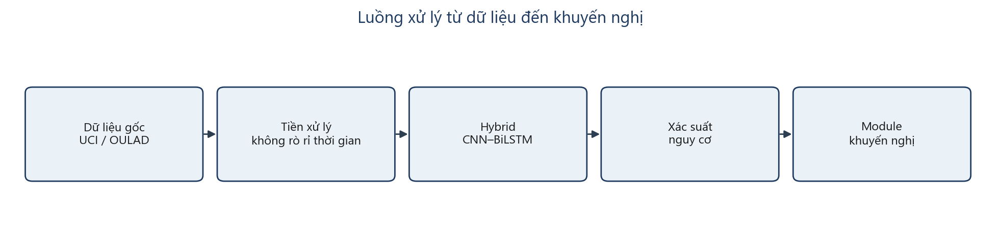
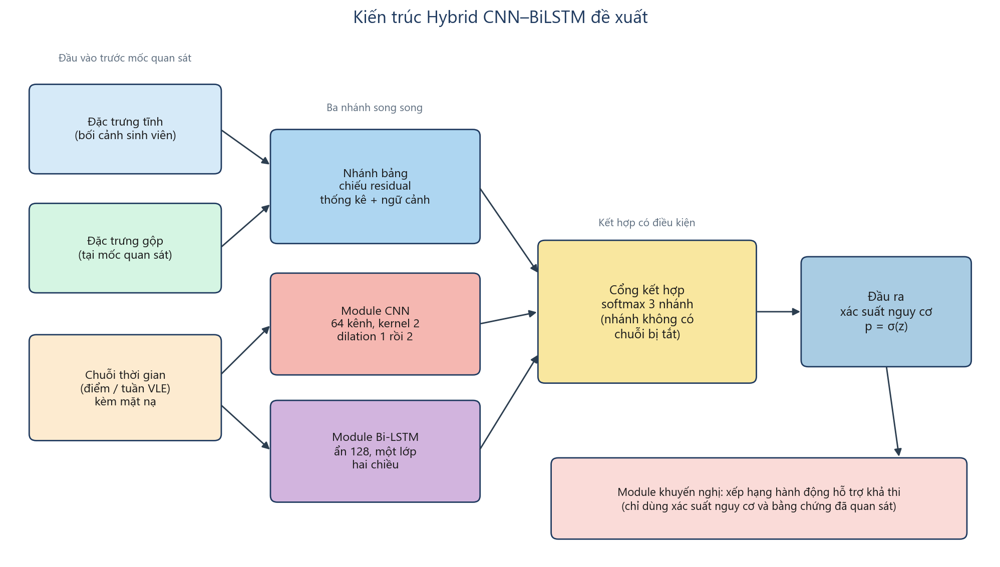
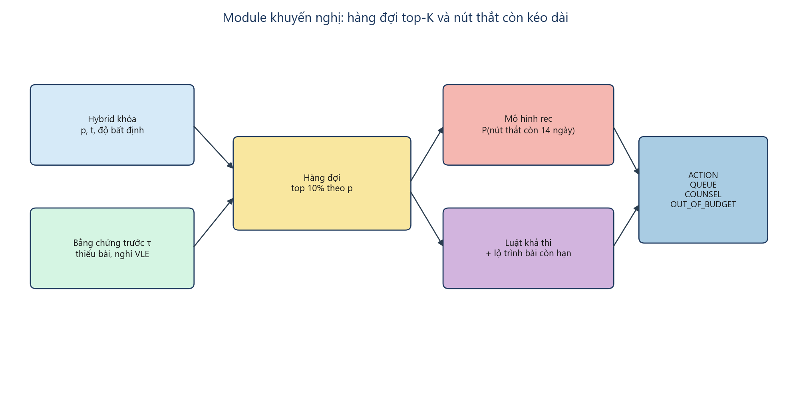

# Chương 3. Phân tích và thiết kế hệ thống

Đối tượng nghiên cứu chính là mô hình Hybrid CNN–BiLSTM, dùng để dự đoán nguy cơ học tập nhị phân trên hai miền độc lập UCI và OULAD, kết hợp module khuyến nghị để xếp hạng hành động hỗ trợ trên OULAD. Các mô hình học máy truyền thống được sử dụng để so sánh trên cùng quy trình đánh giá.

Chương này trình bày phân tích dữ liệu đầu vào, quy trình tiền xử lý, kiến trúc mô hình đề xuất, cấu hình huấn luyện và thiết kế module khuyến nghị. Toàn bộ số liệu hiệu suất và nhận xét kết quả được trình bày ở Chương 4.

---

## 3.1. Phân tích dữ liệu đầu vào

Trước khi xây dựng mô hình, việc phân tích và tìm hiểu sâu về dữ liệu đầu vào là một bước vô cùng quan trọng. Bước này giúp bảo đảm các đặc trưng được lựa chọn phù hợp với bài toán cảnh báo sớm, không chứa thông tin của nhãn hay của tương lai, từ đó làm cơ sở cho một mô hình dự báo có ý nghĩa.

### 3.1.1. Mô tả bộ dữ liệu

Đề tài sử dụng hai bộ dữ liệu độc lập, không gộp thành một tập huấn luyện chung. Cùng một kiến trúc Hybrid nhận đầu vào thống nhất; sự khác nhau giữa hai miền nằm ở chiều đặc trưng và trọng số đã học.

Bộ UCI Student Performance (Cortez và Silva, 2008) gồm dữ liệu điểm theo học kỳ của môn Toán (395 bản ghi) và môn Tiếng Bồ Đào Nha (649 bản ghi). Sau khi gộp, tập làm việc có 1.044 bản ghi và 33 thuộc tính gốc. Mỗi bản ghi tương ứng một cặp học sinh–môn. Bản chất dữ liệu là tĩnh theo học kỳ: chuỗi điểm tối đa hai bước (G1 rồi G2). Nhãn nhị phân được tạo một lần từ điểm cuối kỳ: nguy cơ khi G3 nhỏ hơn 10, không nguy cơ khi G3 lớn hơn hoặc bằng 10. Tỷ lệ lớp nguy cơ là 0,220 (230/1.044). Để tránh đưa cùng một học sinh vào cả tập huấn luyện lẫn tập kiểm định, 13 trường nhận dạng ổn định được dùng để tạo 662 nhóm học sinh; 366 nhóm xuất hiện ở cả hai môn.

Thông tin điểm giữa kỳ được đưa vào theo mốc: S0 chưa có G1 và G2, S1 đã có G1, S2 đã có G1 rồi G2. Chi tiết các nhóm thuộc tính sau khi xác định vai trò được mô tả trong bảng dưới đây.

| Thuộc tính | Mô tả | Vai trò |
|---|---|---|
| G3 | Điểm cuối kỳ, thang 0–20 | Chỉ dùng để tạo nhãn; không đưa vào đầu vào |
| G1, G2 | Điểm kỳ 1 và kỳ 2 | Chuỗi thời gian theo mốc S1, S2 |
| failures | Số lần không đạt môn trước đó | Đặc trưng nền |
| age, Medu, Fedu, traveltime, studytime, famrel, freetime, goout, Dalc, Walc, health | Tuổi, học vấn phụ huynh, thời gian đi học và học tập, quan hệ gia đình, thời gian rảnh, đi chơi, rượu, sức khỏe | Đặc trưng nền dạng số |
| school, sex, address, famsize, Pstatus, Mjob, Fjob, reason, guardian, schoolsup, famsup, paid, activities, nursery, higher, internet, romantic, subject | Trường, giới, chỗ ở, gia đình, nghề phụ huynh, lý do chọn trường, hỗ trợ, hoạt động, môn học | Đặc trưng nền dạng phân loại |
| absences | Số buổi vắng | Không sử dụng, vì có thể đồng thời với kết quả học kỳ |

Bảng 3.1. Mô tả các thuộc tính UCI sau khi xác định vai trò trong mô hình.

Bộ OULAD (Kuzilek, Hlosta và Zdrahal, 2017) gồm 32.593 lượt ghi danh của 28.785 sinh viên, kèm nhật ký tương tác trên môi trường học trực tuyến. Bản chất dữ liệu là chuỗi hành vi theo thời gian. Nhãn nhị phân nhận giá trị dương khi kết quả cuối môn là Fail hoặc Withdrawn. Năm mốc quan sát được đặt tại 20%, 35%, 50%, 75% và 100% chiều dài môn. Sự kiện chỉ được lấy khi xảy ra trước mốc cắt. Số bản ghi còn đủ điều kiện lần lượt khoảng 26.697, 25.606, 24.599, 23.159 và 22.522.

| Nhóm thông tin | Mô tả | Vai trò |
|---|---|---|
| Kết quả cuối môn | Pass, Distinction, Fail, Withdrawn | Chỉ dùng để tạo nhãn |
| Điểm bài kiểm tra, ngày hủy đăng ký | Thông tin đồng thời hoặc sau mốc cắt | Không dùng làm đầu vào |
| Mười một kênh theo tuần | Cường độ hoạt động, số ngày hoạt động, số tài nguyên, diễn đàn, bài kiểm tra, nộp bài, nộp trễ | Chuỗi cho CNN và BiLSTM |
| Mười ba thống kê gộp tại mốc | Hoạt động cộng dồn, trung bình tuần, xu hướng, chuỗi nghỉ, mức hoàn thành bài | Nhánh bảng |
| Thông tin nền | Giới, vùng, trình độ, hoàn cảnh, môn, mùa nhập học, số lần học lại, tín chỉ | Đặc trưng tĩnh |

Bảng 3.2. Mô tả các nhóm thuộc tính OULAD sau khi xác định vai trò trong mô hình.

### 3.1.2. Phân tích tương quan và lựa chọn thuộc tính

Để hiểu rõ hơn mối quan hệ giữa các biến nền và nhãn nguy cơ trên UCI, hệ số Spearman với nhãn G3 nhỏ hơn 10 được xem xét trên toàn bộ 1.044 bản ghi, trước khi chuẩn hóa theo tập huấn luyện. Đây là bước mô tả dữ liệu nhằm định hướng lựa chọn thuộc tính, không phải đánh giá hiệu suất mô hình.

Dựa trên phân tích:

- Tương quan nghịch: G1, G2 và G3 đều tương quan nghịch mạnh với nhãn nguy cơ, nghĩa là điểm càng cao thì xác suất G3 nhỏ hơn 10 càng thấp. G3 bị loại khỏi đầu vào vì chính nó tạo nhãn. G1 và G2 được giữ nhưng chỉ khi mốc đã quan sát được, dưới dạng chuỗi có mặt nạ.
- Tương quan thuận: số lần không đạt môn trước đó là tín hiệu nền rõ nhất còn lại. Tuổi, học vấn phụ huynh, thời gian học và mức đi chơi có tương quan yếu hơn nhưng vẫn mang ngữ cảnh.
- Biến bị loại dù tương quan yếu: số buổi vắng không được dùng, vì có thể đồng thời với kết quả học kỳ, không phù hợp với cảnh báo sớm.

Lý do lựa chọn thuộc tính:

Mặc dù một số tương quan của biến nền không mạnh, chúng vẫn cho thấy mối liên hệ nhất định giữa hoàn cảnh học tập và nguy cơ. Trong bài toán cảnh báo sớm, các biến ngoại sinh cung cấp ngữ cảnh cho nhánh bảng, trong khi tín hiệu mạnh của điểm giữa kỳ và nhật ký tương tác được dành cho CNN và BiLSTM. Do đó đề tài giữ toàn bộ đặc trưng nền hợp lệ, đưa G1 và G2 vào chuỗi đúng mốc, và trên OULAD khóa mười một kênh tuần cùng mười ba thống kê gộp tại mốc cắt. Kết quả cuối môn, điểm bài kiểm tra, ngày hủy đăng ký và độ dài chuỗi quan sát không được dùng làm đầu vào.

---

## 3.2. Quy trình tiền xử lý dữ liệu

Để xây dựng một mô hình học sâu hiệu quả, việc chuẩn bị dữ liệu sạch, có cấu trúc và không rò rỉ thời gian là bước nền tảng. Quy trình được thực hiện có hệ thống từ dữ liệu thô đến đầu vào sẵn sàng cho huấn luyện.

### 3.2.1. Thu thập và khám phá dữ liệu

Quá trình bắt đầu bằng việc đọc hai tập điểm UCI và các bảng ghi danh, khóa học cùng nhật ký tương tác của OULAD. Khảo sát ban đầu cho thấy UCI đang ở dạng bản ghi học kỳ, chưa phải chuỗi tuần; nhật ký OULAD đang ở dạng sự kiện theo ngày, cần được gom theo tuần trước mốc cắt. Nhãn chỉ được tạo một lần từ G3 hoặc từ kết quả cuối môn.

### 3.2.2. Tái cấu trúc và xử lý rò rỉ thời gian

Sau khi đọc dữ liệu gốc, các bước biến đổi được thực hiện để có cấu trúc chuỗi có mặt nạ, đồng thời loại thông tin tương lai.

Trên UCI, nhãn được tạo từ G3 theo ngưỡng 10. Định danh bản ghi và nhóm học sinh được giữ ổn định để chia tập theo nhóm. Chuỗi gồm G1 đã chia 20 tại S1 và S2, thêm G2 tại S2; S0 không có bước thời gian hợp lệ. Thống kê gộp năm chiều chỉ bật khi đã có điểm tại mốc đó. G1, G2, G3 và số buổi vắng không đi vào vector đặc trưng tĩnh.

Trên OULAD, tương tác được gom theo tuần với điều kiện thời điểm sự kiện nhỏ hơn mốc cắt. Bài đánh giá chỉ tính hạn và ngày nộp trước mốc cắt. Lượt ghi danh đã hủy trước mốc cắt bị loại khỏi mốc đó. Độ dài chuỗi quan sát không được dùng làm đặc trưng, vì tại mốc 100% đại lượng này vẫn liên đới với việc rút khỏi môn.

Kết quả giai đoạn này là hai bộ đầu vào cùng khuôn dạng: đặc trưng tĩnh, chuỗi có mặt nạ, thống kê gộp, tiến độ môn và nhãn nhị phân.

### 3.2.3. Chuẩn hóa và phân chia dữ liệu

Các thuộc tính có thang đo khác nhau nên được chuẩn hóa. Trung bình, phương sai và bộ mã hóa biến phân loại chỉ được ước lượng trên tập huấn luyện, rồi áp nguyên sang tập dừng và tập kiểm định. Chuỗi chỉ chuẩn hóa trên các ô có mặt nạ bằng 1. Thống kê gộp chỉ chuẩn hóa trên các dòng thực sự có thống kê tại mốc.

Biến độc lập là bộ đặc trưng trên; biến phụ thuộc là nhãn nguy cơ. Việc chia tập theo nhóm học sinh trên UCI và theo mã sinh viên trên OULAD. Phần chia ngoài được giữ để loại định danh, không dùng khi chọn kiến trúc. Phần còn lại được chia thành tập huấn luyện, tập dừng và tập kiểm định trong. Ba hạt giống 42, 1201 và 2026 được dùng khi huấn luyện.

Kích thước chuỗi trên UCI cố định hai bước, một kênh điểm đã chia 20. Trên OULAD, chuỗi được đệm đến độ dài của mốc dài nhất, mười một kênh tuần và mười ba thống kê gộp.

### 3.2.4. Kiến trúc mô hình đề xuất

Mô hình kết hợp khả năng của nhánh bảng trong việc mã hóa ngữ cảnh và thống kê tại mốc quan sát, khả năng của CNN trong việc trích mẫu cục bộ trên chuỗi có mặt nạ, và khả năng của BiLSTM trong việc nắm bắt phụ thuộc hai chiều theo thời gian. Khác với kiến trúc CNN nối tiếp BiLSTM thuần túy, Hybrid CNN–BiLSTM chạy CNN song song với BiLSTM, rồi trộn với nhánh bảng qua cổng softmax ba nhánh có điều kiện hiện diện.

Luồng tổng thể từ dữ liệu đến khuyến nghị và kiến trúc chi tiết được minh họa ở Hình 3.1 và Hình 3.2.

Hình 3.1. Luồng xử lý từ dữ liệu gốc đến xác suất nguy cơ và module khuyến nghị.

Hình 3.2. Kiến trúc Hybrid CNN–BiLSTM đề xuất: ba nhánh song song, cổng kết hợp có điều kiện, đầu ra xác suất nguy cơ.

Một kiến trúc dùng chung cho UCI và OULAD. Một mô hình UCI chấm S0, S1, S2; một mô hình OULAD chấm năm mốc từ 20% đến 100%. Khi chưa có bước thời gian hợp lệ, CNN và BiLSTM bị tắt, chỉ nhánh bảng còn hoạt động. Đây là hành vi được thiết kế, không phải trường hợp lỗi.

### 3.2.5. Module CNN

Module này đóng vai trò bộ trích xuất đặc trưng tự động trên chuỗi đã được chiếu về 128 chiều và nhân mặt nạ.

Lớp chiếu tuyến tính kèm chuẩn hóa lớp đưa số kênh chuỗi về 128 chiều, sau đó nhân mặt nạ để ô không hợp lệ không đóng góp. Hai khối dư sử dụng 64 bộ lọc, kích thước hạt 2, giãn nở 1 rồi 2, hàm kích hoạt GELU và Dropout. Mỗi khối được đệm đối xứng theo hệ số giãn nở rồi nhân lại mặt nạ. Đầu ra được gộp bằng trung bình và cực đại có mặt nạ, rồi chiếu về 128 chiều. Nếu không có bước thời gian hợp lệ, vector CNN bằng 0.

### 3.2.6. Module Bi-LSTM

Chuỗi sau lớp chiếu 128 chiều được đưa vào BiLSTM để mô hình hóa phụ thuộc thời gian hai chiều. Module gồm một lớp LSTM hai chiều, kích thước ẩn 128, đóng gói theo độ dài thực để không học phần đệm. Đầu ra 256 chiều được gộp bằng trung bình và cực đại có mặt nạ rồi chiếu về 128 chiều. Dropout được đặt trên các lớp chiếu và đầu ra, không xếp thêm lớp BiLSTM thứ hai. Khi chưa có chuỗi, vector BiLSTM bằng 0.

Việc dùng hai chiều cho phép tại mỗi bước thời gian học thông tin từ quá khứ và từ ngữ cảnh tương lai trong cửa sổ đã quan sát, không nhìn sự kiện sau mốc cắt.

### 3.2.7. Module fusion và đầu ra

Đây là module cuối của mô hình dự đoán, có nhiệm vụ tổng hợp đặc trưng bậc cao từ ba nhánh và đưa ra xác suất nguy cơ.

Nhánh bảng chiếu đặc trưng tĩnh và thống kê gộp về 128 chiều bằng khối residual (lối tắt tuyến tính cộng nhánh sâu Linear – chuẩn hóa – GELU – Dropout – Linear). Thống kê gộp được nhân cờ hiện diện trước khi cộng vào nhánh tĩnh.

Cổng softmax nhận biểu diễn ba nhánh, ba cờ hiện diện và mức tiến độ môn. Nhánh CNN và BiLSTM chỉ hiện diện khi có ít nhất một bước thời gian hợp lệ. Logit của nhánh không hiện diện được gán âm vô cùng trước softmax, nên khối lượng của nhánh đó bằng 0. Biểu diễn trộn là tổng có trọng số của ba vector. Một số hạng entropy nhỏ được thêm khi nhiều nhánh cùng hiện diện, nhằm tránh cổng sụp về một nhánh quá sớm; số hạng này không thay hàm mất mát chính.

Khối đầu ra gồm chuẩn hóa, Linear 128, GELU, Dropout và Linear 1. Giá trị logit được đẩy qua hàm sigmoid để được xác suất nguy cơ. Nhãn vận hành so sánh xác suất với ngưỡng đã chọn trên tập dừng. Độ bất định nhị phân được tính từ entropy của xác suất, phục vụ bước định tuyến của module khuyến nghị. Module khuyến nghị không đọc vector ẩn của CNN hay BiLSTM.

### 3.2.8. Cấu hình chi tiết mô hình

Bảng dưới đây tóm tắt từng khối của kiến trúc được triển khai, cùng số tham số của mô hình OULAD.

| Khối | Thiết lập | Ghi chú |
|---|---|---|
| Chiếu đặc trưng tĩnh | Vào số chiều tĩnh, ra 128 | Residual |
| Chiếu thống kê gộp | Vào 13 (OULAD) hoặc 5 (UCI), ra 128 | Nhân cờ hiện diện |
| Chiếu chuỗi | Số kênh chuỗi lên 128 | Nhân mặt nạ |
| CNN | Hai khối, 64 kênh, hạt 2, giãn nở 1 và 2 | An toàn mặt nạ |
| BiLSTM | Ẩn 128, một lớp, hai chiều | Đóng gói theo độ dài thực |
| Cổng kết hợp | 388 vào, 64 ẩn, 3 đầu ra | Ba nhánh, ba cờ, một tiến độ |
| Đầu ra | 128 xuống 1 logit | Xác suất nguy cơ |
| Số tham số (OULAD) | 482.116 | Cùng cấu trúc với UCI, khác chiều đầu vào |

Bảng 3.3. Cấu hình chi tiết Hybrid CNN–BiLSTM.

Phần lớn tham số tập trung ở các khối chiếu residual, BiLSTM và đầu ra. Mô hình đủ gọn để huấn luyện trên GPU 6 GB, đồng thời đủ dung lượng để học quan hệ phi tuyến trên chuỗi. Topology không đổi giữa hai miền; khác nhau chủ yếu ở tốc độ học, Dropout, kích thước lô, hệ số trọng số lớp dương và chiều đầu vào.

---

## 3.3. Quy trình huấn luyện mô hình

Quy trình được thiết kế để mỗi miền chỉ dùng một mô hình cho mọi mốc thông tin, dừng sớm trên tập dừng, và không nhìn phần chia ngoài khi chốt siêu tham số.

### 3.3.1. Cấu hình huấn luyện

- Thiết kế kiến trúc:
  - Hybrid CNN–BiLSTM với ba nhánh song song và cổng softmax có điều kiện.
  - Cùng kiến trúc cho UCI và OULAD.
  - Tắt CNN và BiLSTM khi chưa có chuỗi.
  - Không huấn luyện mô hình riêng cho mốc 100% của OULAD.
- Hàm tối ưu và hàm mất mát:
  - AdamW.
  - Entropi chéo nhị phân trên logit, trọng số lớp dương bằng tỷ lệ âm/dương trên tập huấn luyện nhân hệ số 1,183 (UCI) hoặc 0,779 (OULAD).
  - Không chọn SMOTE hay ADASYN trên tensor, vì nội suy không tạo điểm giữa kỳ hay tuần tương tác thật.
- Tham số huấn luyện:
  - UCI: tốc độ học 8,61×10⁻⁵, weight decay 3,29×10⁻³, Dropout 0,406, lô 32.
  - OULAD: tốc độ học 1,18×10⁻⁴, weight decay 7,11×10⁻⁴, Dropout 0,320, lô 128.
  - Hạt giống huấn luyện: 42, 1201, 2026.
  - Dừng sớm theo AP trên tập dừng.
- Phần cứng:
  - Tự phát hiện GPU; huấn luyện hỗn hợp độ chính xác trên RTX 2060.
  - Tập dừng và tập kiểm định chạy ở chế độ đánh giá, tắt Dropout.
- Lưu mô hình:
  - Lưu trọng số khi AP trên tập dừng cải thiện.
  - Ngưỡng quyết định chọn trên tập dừng theo F1, rồi độ nhạy, rồi độ gần 0,5. Tập kiểm định không chọn ngưỡng.

### 3.3.2. Quy trình huấn luyện

Tập không thuộc phần chia ngoài được chia ba phần theo nhóm. Với mỗi cặp phần chia và hạt giống, mô hình được khởi tạo lại từ đầu. Bộ chuẩn hóa và trọng số lớp dương chỉ fit trên tập huấn luyện. Mỗi vòng lặp gồm bước huấn luyện trên tập huấn luyện và bước đánh giá AP trên tập dừng. Nếu AP dừng cải thiện thì trọng số được lưu. Sau khi dừng, ngưỡng được chọn trên tập dừng rồi áp lên tập kiểm định. Kết quả mỗi mốc là trung bình 9 lần chạy, trình bày ở Chương 4. Không chọn lần chạy đẹp nhất và không chọn phần chia theo kết quả kiểm định.

Hai miền được huấn luyện tách biệt. Sau huấn luyện, xác suất trên các mốc 20–75% của OULAD được giữ lại để đánh giá module khuyến nghị.

---

## 3.4. Đóng gói mô hình Hybrid CNN–BiLSTM

Để sử dụng mô hình đã huấn luyện cho dự đoán, trọng số và bộ chuẩn hóa của từng miền được lưu lại. Khi dự đoán, kiến trúc được khởi tạo đúng cấu hình đã mô tả, nạp trọng số, chuyển sang chế độ đánh giá và áp dụng cùng quy tắc mặt nạ, mốc cắt như lúc huấn luyện. Bộ chuẩn hóa không được ước lượng lại trên dữ liệu mới.

Đầu ra gồm xác suất nguy cơ, ngưỡng đã chọn trên tập dừng, nhãn vận hành và độ bất định. Các đại lượng này là toàn bộ thông tin mà module khuyến nghị được phép đọc từ mô hình dự đoán.

Mốc 100% của OULAD không được đưa vào module khuyến nghị, vì đó không còn là thời điểm cảnh báo sớm.

---

## 3.5. Thiết kế module khuyến nghị

Module khuyến nghị không thay thế Hybrid CNN–BiLSTM và không học lại “ai đang có nguy cơ”. Hybrid xếp hạng sinh viên theo xác suất `p`. Module cắt một hàng đợi top K theo `p`, rồi học nút thắt nào còn kéo dài trong 14 ngày sau mốc cắt. Lộ trình kèm theo là danh sách bài đánh giá còn hạn. Module không ước lượng hiệu ứng nhân quả lên điểm cuối môn.

### 3.5.1. Kiến trúc tổng thể

Luồng gồm bốn bước, minh họa ở Hình 3.3.

Hình 3.3. Hybrid khóa cung cấp `p`; rec học nút thắt còn kéo dài và phát hành trên hàng đợi top-K.

- Bước 1. Tiếp nhận `PredictionResult` (`p`, ngưỡng `t`, nhãn vận hành, độ bất định) và bằng chứng LMS đã quan sát trước mốc cắt. Mốc 100% bị loại.
- Bước 2. Hàng đợi dung lượng-K. Trong mỗi đợt (môn × kỳ × mốc), lấy top 10% theo `p`. Ngưỡng `t` không cắt rec.
- Bước 3. Lọc khả thi cứng: hoàn thành bài khi còn thiếu hoặc sắp hạn; phục hồi tương tác khi nghỉ dài hoặc tỷ lệ ngày hoạt động rất thấp. Không có đòn bẩy LMS thì chuyển tư vấn.
- Bước 4. Mô hình phân loại ba lớp (ASSESS, ENGAGE, COUNSEL) học nhãn tồn tại 14 ngày trên nhật ký nộp bài và VLE. Suy luận không đọc kết quả cuối môn. Đầu ra gồm một hành động, lộ trình bài còn hạn `Q_τ`, và trạng thái ACTION / QUEUE / COUNSEL / OUT_OF_BUDGET.

Đối sánh bắt buộc là luật đuôi cùng độ ưu tiên (thiếu bài trước, rồi nghỉ VLE).

### 3.5.2. Nhãn học và luật khả thi

Nhãn train/test: nếu bài đang thiếu tại τ vẫn chưa nộp sau 14 ngày thì ASSESS; nếu đang im VLE tại τ và không có click trong 14 ngày thì ENGAGE; còn lại COUNSEL. Kết quả Fail hoặc Withdrawn không dùng làm đặc trưng hay nhãn rec.

| Hành động | Được xét khi | Không xét khi |
|---|---|---|
| Hoàn thành bài đánh giá (ASSESS) | Còn bài thiếu hoặc ≥ 2 bài sắp hạn | Không còn khoảng nộp |
| Phục hồi tương tác (ENGAGE) | Nghỉ ≥ 7 ngày hoặc tỷ lệ ngày hoạt động < 0,20, còn VLE | Không có nhật ký tương tác |
| Tư vấn (COUNSEL) | Trong hàng đợi, không đuôi LMS | — |

Bảng 3.4. Điều kiện khả thi của module khuyến nghị khóa.

### 3.5.3. Mối liên hệ với mô hình dự đoán

Rec chỉ đọc `p`, ngưỡng, nhãn vận hành và độ bất định từ Hybrid, cộng bằng chứng trước mốc cắt. Không đọc vector ẩn. `p` quyết định ai vào hàng đợi; rec quyết định nút thắt nào còn lại. Đánh giá bốn tầng (chọn lọc, khả thi, khớp nhãn 14 ngày, tiên lượng có kiểm soát `p`) trình bày ở Chương 4.
