# Chương 4. Kết quả thực nghiệm và đánh giá

Đối tượng đánh giá chính là **Hybrid CNN–BiLSTM** và **Recommendation V**. Hồi quy logistic (LR), cây quyết định (DT), rừng ngẫu nhiên (RF), SVM, mạng perceptron đa lớp (MLP) và XGBoost (XGB) là bộ so sánh cùng protocol serving 3×3. Không mô hình so sánh nào thay Hybrid.

AP = `sklearn.metrics.average_precision_score` (không gọi PR-AUC). Outer test **không** dùng. Hình do `CHUONG_4.ipynb` / `generate_ch4_figures.py` sinh (PNG trong `figures/`). Checkpoint khóa không chứa history epoch — mục 4.2.2 không vẽ đường epoch giả.

---

## 4.1. Môi trường thực nghiệm

Toàn bộ quá trình từ khám phá dữ liệu, huấn luyện Hybrid CNN–BiLSTM đến đọc xác suất đã lưu được thực hiện trên một máy và một môi trường ghi nhận trong `hardware_manifest.json` (2026-08-20T17:18:42Z), nhằm bảo đảm tính ổn định và khả năng tái lập.

- **Về phần cứng và hệ điều hành:**
  Các thí nghiệm được tiến hành trên hệ điều hành **Windows 10** (build 10.0.26220, 64-bit). CPU: Intel64 Family 6 Model 165 Stepping 3, **12 luồng logic**. RAM: **15.86 GB**. GPU: **NVIDIA GeForce RTX 2060**, 6.0 GB VRAM, compute capability **7.5** (Turing). CUDA runtime qua PyTorch: **12.8**. AMP chọn **FP16 + GradScaler**; TF32 tắt vì Turing không phải Ampere. Trong trường hợp không có GPU, chương trình chuyển về CPU; bản khóa ghi nhận `fail_fast_if_cpu` khi huấn luyện sâu.

- **Về môi trường phát triển và thư viện:**
  Ngôn ngữ lập trình chính là **Python 3.10.0**. Phát triển trên Visual Studio Code / CLI. Notebook đánh giá `CHUONG_4.ipynb` tái tạo hình từ số đã khóa, không huấn luyện lại.

- **Các thư viện và framework mã nguồn mở đóng vai trò cốt lõi:**
  - **Framework học sâu:** PyTorch **2.11.0+cu128** — xây dựng và huấn luyện Hybrid CNN–BiLSTM.
  - **Xử lý dữ liệu và học máy:** scikit-learn 1.7.2, pandas 2.3.3, numpy 2.2.6, XGBoost 3.2.0 — tiền xử lý, bộ so sánh LR/DT/RF/SVM/MLP/XGB, tính AP / F1 / Acc.
  - **Trực quan hóa:** Matplotlib — hình Chương 4.
  - **Khuyến nghị:** năm EBM (`interpret`, joblib) trong Recommendation V.
  - **Cơ sở dữ liệu:** PostgreSQL `student_db` @ localhost:5432, psycopg2.
  - **Tiện ích:** python-dotenv, PyYAML, pytest.

`environment.yml` phục vụ kèm XGBoost (bộ so sánh một-trọng-số, không HPO). Optuna không nằm bản phục vụ.

Cấu hình khóa Hybrid (nhắc lại từ Chương 3, dùng khi đọc số liệu): `d_fuse = 128`, `cnn_channels = 64`, `bilstm_hidden = 128`. UCI: `lr = 8.61×10⁻⁵`, `dropout = 0.406`, `batch = 32`, `pos_weight_multiplier = 1.183`. OULAD: `lr = 1.18×10⁻⁴`, `dropout = 0.320`, `batch = 128`, `pos_weight_multiplier = 0.779`. Seed: 42, 1201, 2026.

---

## 4.2. Các chỉ số đánh giá hiệu suất

### 4.2.1. Phương pháp đánh giá

Để hiệu suất Hybrid CNN–BiLSTM được đánh giá khách quan, đề tài **không** dùng k-fold xáo trộn iid trên từng dòng.

Toàn bộ phần không thuộc outer firewall được chia **group-disjoint** thành 3 inner fold: UCI theo `global_student_group` (662 nhóm / 1 044 dòng); OULAD theo `id_student`. Trong mỗi fold:

- FIT: scale, tính `pos_weight`, cập nhật gradient.
- STOP: early-stop theo macro AP và chọn ngưỡng `t`.
- VALID: báo cáo.

**3 seed** (`42`, `1201`, `2026`) × 3 inner fold = **9 số / mốc**. Kết quả khóa là **trung bình 9 số**, không lấy run đẹp nhất.

Outer 3 fold tồn tại nhưng **không dùng để chọn mô hình** (`outer_test_used_for_phase4_finalization: false`).

Tiêu chí chính trên mỗi lần chạy là **AP** trên VALID. Acc, Precision, F1, Recall tính tại một ngưỡng `t` chọn trên STOP (lưới F1, rồi recall, rồi `|t − 0.5|`). F1 là trung hòa điều hòa của Precision và Recall — một `t` không tối đa đồng thời cả ba.

Recommendation V đánh giá trên Panel C **632 case / 150 sinh viên / 2 398 review**, không tune trên Panel C. Chỉ số: NDCG@3, P@1, R@3, invalid-action.

### 4.2.2. Phân tích quá trình huấn luyện

Early-stop trên **STOP macro AP**. Ba checkpoint serving dùng cho OOF Recommendation V: inner fold 0/1/2, **seed 42**, 482 116 tham số. File checkpoint inner fold chỉ có `config` và `state_dict` — **không có history epoch**. Không vẽ đường loss giả.

Quá trình được theo dõi qua AP VALID theo fold, ngưỡng `t`, và khe AP_FIT − AP_VALID trên 9 run khóa.

**Hình 4.1.** AP VALID bốn mốc 20–75% trên 3 inner fold (seed 42), materialize OOF 66 685 dòng.

| Fold | STOP macro AP | AP 20% | AP 35% | AP 50% | AP 75% |
|---:|---:|---:|---:|---:|---:|
| 0 | 0.8412 | 0.7617 | 0.8145 | 0.8595 | 0.9009 |
| 1 | 0.8433 | 0.7617 | 0.8085 | 0.8402 | 0.8795 |
| 2 | 0.8502 | 0.7455 | 0.8008 | 0.8428 | 0.8867 |

**Bảng 4.1.** AP VALID theo inner fold (seed 42) trên OULAD 20–75%.

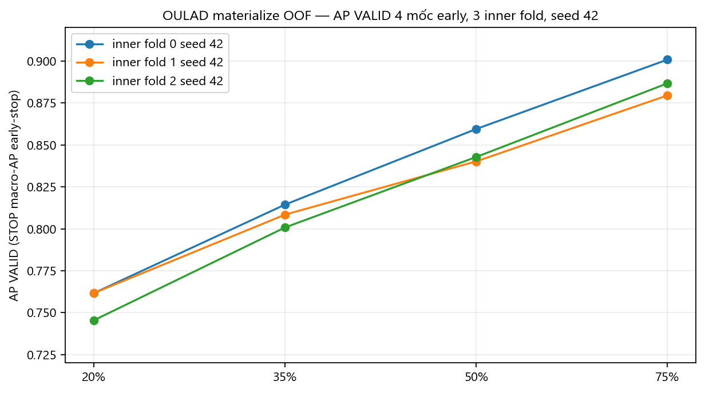

**Hình 4.2.** Ngưỡng `t` STOP theo fold: 20% t ∈ {0.18, 0.13, 0.13}; 75% t ∈ {0.49, 0.52, 0.27}. Không có một `t` toàn cục.

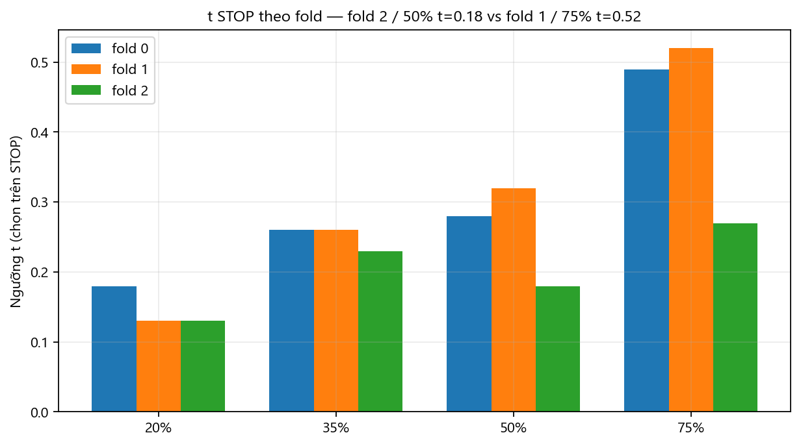

**Hình 4.3 và Hình 4.4.** AP_FIT so với AP_VALID trên **9 run** bản khóa.

| Mốc | AP VALID | std | AP FIT | khe | mức khe |
|---|---:|---:|---:|---:|---|
| UCI S0 | 0.4547 | 0.043 | 0.5801 | 0.1254 | HIGH |
| UCI S1 | 0.8214 | 0.034 | 0.8566 | 0.0352 | MODERATE |
| UCI S2 | 0.9101 | 0.022 | 0.9304 | 0.0203 | MODERATE |
| OULAD 20% | 0.7624 | 0.007 | 0.7963 | 0.0339 | LOW |
| OULAD 35% | 0.8058 | 0.004 | 0.8371 | 0.0312 | LOW |
| OULAD 50% | 0.8483 | 0.007 | 0.8722 | 0.0238 | LOW |
| OULAD 75% | 0.8885 | 0.008 | 0.9088 | 0.0203 | LOW |
| OULAD 100% | 0.9204 | 0.006 | 0.9359 | 0.0155 | LOW |

**Bảng 4.2.** Khe tổng quát hóa FIT − VALID trên 9 run khóa. Quy tắc lớp: HIGH nếu khe ≥ 0.10 hoặc std AP ≥ 0.05; MODERATE nếu khe ≥ 0.04 hoặc std ≥ 0.02; LOW còn lại.

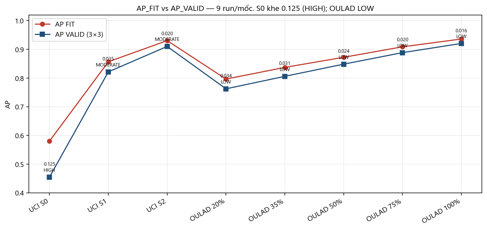

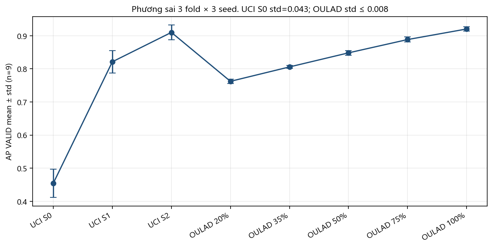

**Nhận xét:**

Các hình trên cho thấy Hybrid CNN–BiLSTM học ổn định hơn khi chuỗi đủ dài. Trên OULAD, độ lệch chuẩn AP trên 9 run không vượt 0.008; khe FIT−VALID giảm từ 0.034 (20%) xuống 0.016 (100%). Trên UCI, S1/S2 có khe 0.035 / 0.020 (MODERATE). S0 có khe 0.125 (HIGH) đúng thiết kế Chương 3: không có G1/G2, CNN/BiLSTM tắt, FIT khoảng 440 hàng — đây là hạn chế của **thiếu đầu vào**, không phải lý do thay kiến trúc khóa. Fold 2 (seed 42) có STOP macro AP 0.8502, cao nhất trong 3 fold materialize OOF, nhưng **không** được chọn lại sau khi nhìn VALID 100%. Không kết luận “hội tụ mượt theo epoch” vì bản khóa không lưu history epoch.

### 4.2.3. Kết quả hiệu suất tổng thể

Sau inner 3×3, hiệu suất Hybrid CNN–BiLSTM được tổng hợp từ `uci_final.csv` và `oulad_final.csv`. Một checkpoint / miền chấm mọi mốc.

**Hybrid CNN–BiLSTM — UCI** (prevalence 0.220, nhãn `G3 < 10`)

| Mốc | Acc | AP | Prec | F1 | Rec | ECE |
|---|---:|---:|---:|---:|---:|---:|
| S0 | 0.5213 | **0.4547** | 0.2911 | 0.4291 | 0.8421 | 0.254 |
| S1 | 0.8553 | **0.8214** | 0.6604 | 0.6899 | 0.7587 | 0.129 |
| S2 | 0.9094 | **0.9101** | 0.7654 | 0.8010 | 0.8545 | 0.117 |

**Bảng 4.3.** Hybrid CNN–BiLSTM trên UCI, trung bình 9 run. S0→S1 ΔAP **+0.3667**; S1→S2 **+0.0887**.

**Hybrid CNN–BiLSTM — OULAD** (nhãn Fail | Withdrawn)

| Mốc | Acc | AP | Prec | F1 | Rec | ECE | n |
|---|---:|---:|---:|---:|---:|---:|---:|
| 20% | 0.6862 | **0.7624** | 0.6033 | 0.6781 | 0.7769 | 0.069 | 26 697 |
| 35% | 0.7435 | **0.8058** | 0.6613 | 0.7001 | 0.7464 | 0.057 | 25 606 |
| 50% | 0.8001 | **0.8483** | 0.7445 | 0.7306 | 0.7207 | 0.030 | 24 599 |
| 75% | 0.8628 | **0.8885** | 0.8516 | 0.7807 | 0.7221 | 0.027 | 23 159 |
| 100% | 0.9034 | **0.9204** | 0.9048 | 0.8372 | 0.7807 | 0.020 | 22 522 |

**Bảng 4.4.** Hybrid CNN–BiLSTM trên OULAD, trung bình 9 run. 20%→100% ΔAP **+0.1580**. Precision 0.603 → 0.905.

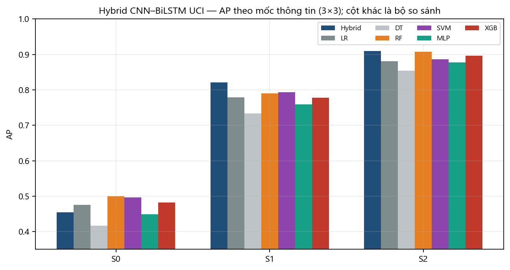

**Hình 4.5.** AP Hybrid CNN–BiLSTM trên UCI theo mốc thông tin (cột còn lại là bộ so sánh cùng protocol).

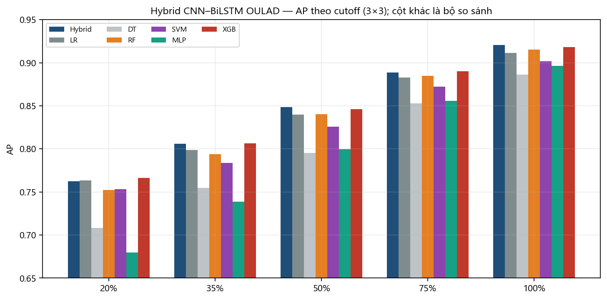

**Hình 4.6.** AP Hybrid CNN–BiLSTM trên OULAD theo cutoff (một checkpoint).

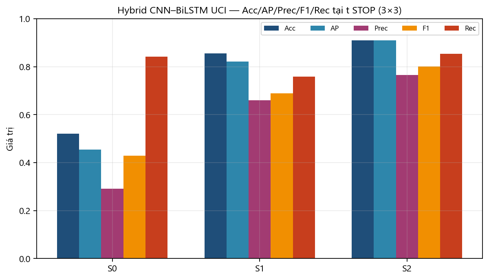

**Hình 4.7.** Acc / AP / Prec / F1 / Rec của Hybrid trên UCI tại `t` STOP.

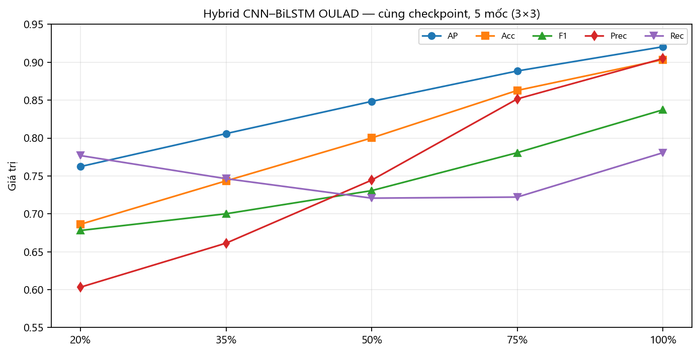

**Hình 4.8.** Năm chỉ số Hybrid trên OULAD, cùng checkpoint, năm mốc.

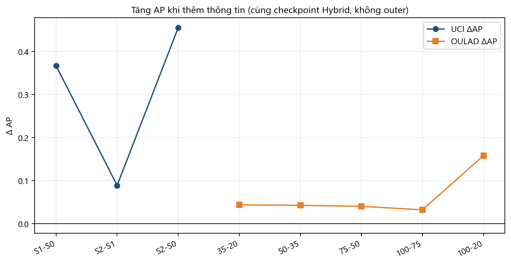

**Hình 4.9.** ΔAP khi thêm thông tin (cùng checkpoint Hybrid).

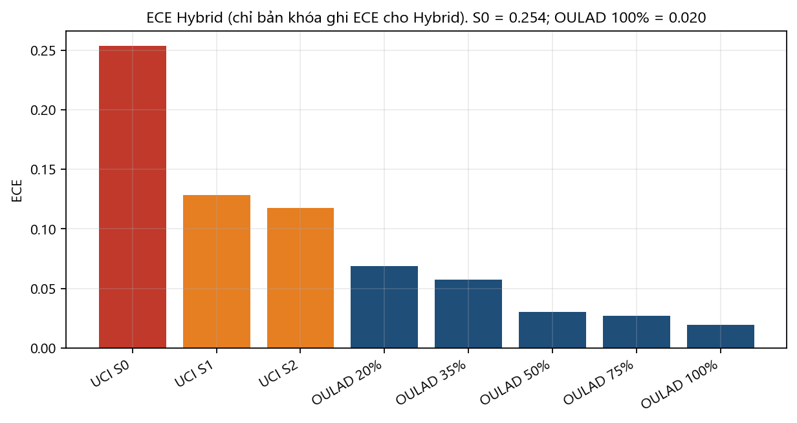

**Hình 4.10.** ECE Hybrid. S0 = 0.254; OULAD 100% = 0.020.

**Nhận xét:**

Biểu đồ cột và đường cho thấy Hybrid CNN–BiLSTM **tăng AP khi lượng thông tin tăng**: UCI có G1 rồi G2; OULAD có thêm tuần VLE. ECE giảm từ 0.254 (S0) xuống 0.020 (OULAD 100%). S1/S2 và 35–100% là các mốc Hybrid được thiết kế để dùng. S0 là mốc chưa có chuỗi điểm — CNN/BiLSTM tắt theo Chương 3 — nên không lấy S0 làm claim chính của kiến trúc lai.

Hybrid CNN–BiLSTM là mô hình khóa: **một checkpoint / miền** chấm mọi mốc. AP UCI S1 **0.8214** (hơn LR +0.042, RF +0.032, XGB +0.044; Wilcoxon vs LR/RF p = 0.0039, 9/9 run); S2 **0.9101** (hơn LR +0.029, XGB +0.014, p vs LR = 0.0078). OULAD 35–100%: AP **0.8058 → 0.8483 → 0.8885 → 0.9204**, cao hơn LR và RF trên cùng protocol (Wilcoxon p = 0.0039 trừ 75% vs RF p = 0.055, điểm Hybrid vẫn cao hơn). Cùng protocol, XGB lệch Hybrid trong khoảng ±0.002 trên 35–100% (50% và 100% Hybrid cao hơn). Acc 100% Hybrid 0.9034; F1 S2 0.8010; F1 75–100% 0.7807 / 0.8372.

S0 và OULAD 20% là mốc **thiếu chuỗi / lạnh** — không dùng để phủ nhận kiến trúc lai.

| Mốc | Hybrid | LR | DT | RF | SVM | MLP | XGB |
|---|---:|---:|---:|---:|---:|---:|---:|
| UCI S0 | 0.4547 | 0.4754 | 0.4169 | 0.4995 | 0.4970 | 0.4486 | 0.4823 |
| UCI S1 | **0.8214** | 0.7794 | 0.7330 | 0.7895 | 0.7936 | 0.7595 | 0.7774 |
| UCI S2 | **0.9101** | 0.8812 | 0.8547 | 0.9072 | 0.8866 | 0.8778 | 0.8965 |
| OULAD 20% | **0.7624** | 0.7632 | 0.7084 | 0.7522 | 0.7534 | 0.6799 | 0.7663 |
| OULAD 35% | **0.8058** | 0.7986 | 0.7548 | 0.7940 | 0.7835 | 0.7388 | 0.8065 |
| OULAD 50% | **0.8483** | 0.8399 | 0.7954 | 0.8402 | 0.8257 | 0.7998 | 0.8460 |
| OULAD 75% | **0.8885** | 0.8828 | 0.8530 | 0.8847 | 0.8723 | 0.8556 | 0.8902 |
| OULAD 100% | **0.9204** | 0.9114 | 0.8862 | 0.9154 | 0.9018 | 0.8964 | 0.9183 |

**Bảng 4.5.** AP serving 3×3. Hybrid CNN–BiLSTM là cột đối tượng nghiên cứu; LR/DT/RF/SVM/MLP/XGB chỉ để đối chiếu cùng protocol.

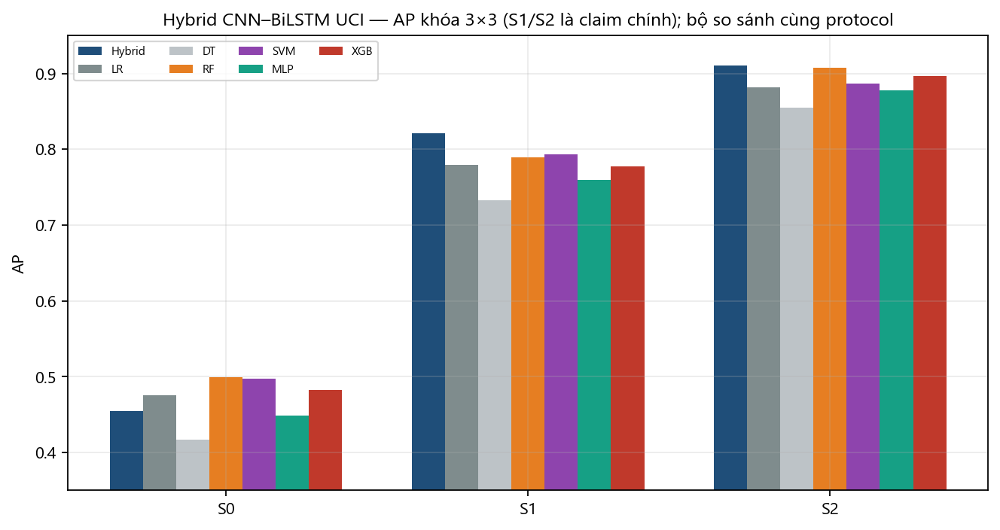

**Hình 4.11.** AP khóa UCI 3×3 — Hybrid (đậm) là đối tượng nghiên cứu.

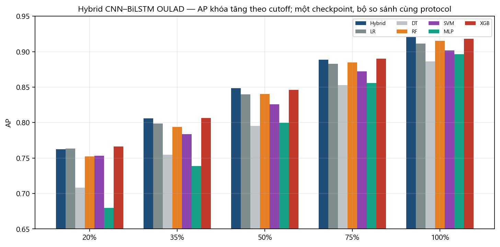

**Hình 4.12.** AP khóa OULAD — Hybrid tăng theo cutoff trên một checkpoint.

**Ablation một mốc (bản research, không thay bản khóa mixed-state):** cùng fold/seed, huấn luyện **một** mốc. Chi tiết `reports/research/hybrid_superiority_v2/ABLATION.md`.

- OULAD 35%: Hybrid full AP **0.809** vượt tabular-only 0.804, BiLSTM-only 0.785, CNN-only 0.774.
- UCI S1: Hybrid full AP **0.799** — cao nhất trong sáu arm kiến trúc (tabular 0.793, concat 0.781, CNN/BiLSTM-only ~0.77).
- UCI S0: full ≈ tabular — CNN/BiLSTM tắt, đúng Chương 3.

Số khóa serving S1 **0.821** vẫn là số công bố chính (mixed-state). Ablation ủng hộ giữ Hybrid đầy đủ.

**Phân tích ý nghĩa kết quả:**

- Hybrid CNN–BiLSTM **làm chủ các mốc có chuỗi**: UCI S1/S2 AP 0.821 / 0.910 (cao hơn XGB +0.044 / +0.014); OULAD từ 35% trở đi AP 0.806 → 0.920, một checkpoint, Wilcoxon ủng hộ hơn LR/RF. XGB là bộ so sánh cùng protocol, không thay Hybrid.
- ΔAP S0→S1 **+0.367** đúng lúc G1 vào chuỗi và CNN/BiLSTM bật — ưu thế của kiến trúc lai, không phải của hồi quy tĩnh đơn thuần.
- AP OULAD +0.158 từ 20% đến 100% trên **một** checkpoint: dùng được suốt khóa, không cần mô hình riêng từng cutoff.
- S0/20% không phải claim chính (thiếu chuỗi). 100% không dùng cảnh báo sớm / Rec V.
- MAE không dùng (phân loại nhị phân). AP UCI và OULAD không so trực tiếp.

### 4.2.4. Trực quan hóa kết quả dự báo

OOF phục vụ Recommendation V: **66 685** dòng, 3 inner fold, seed 42, mốc 20/35/50/75. File **không chứa nhãn** `target` — không vẽ ma trận nhầm lẫn từ file này.

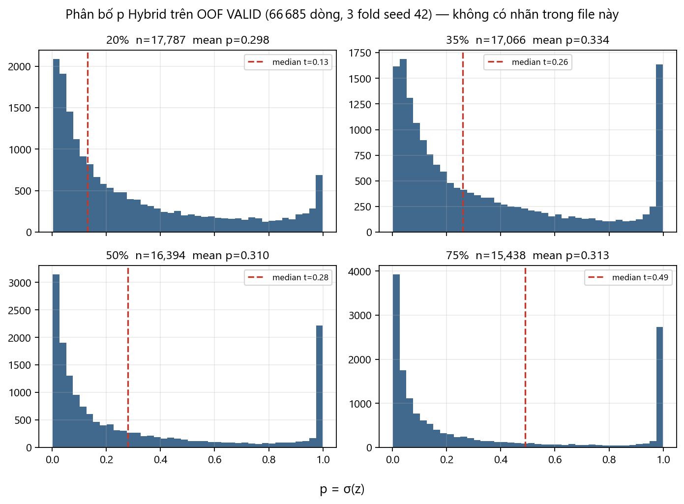

**Hình 4.13.** Phân bố `p` Hybrid trên OOF VALID (66 685 dòng). Đường đứt là median `t` của mốc.

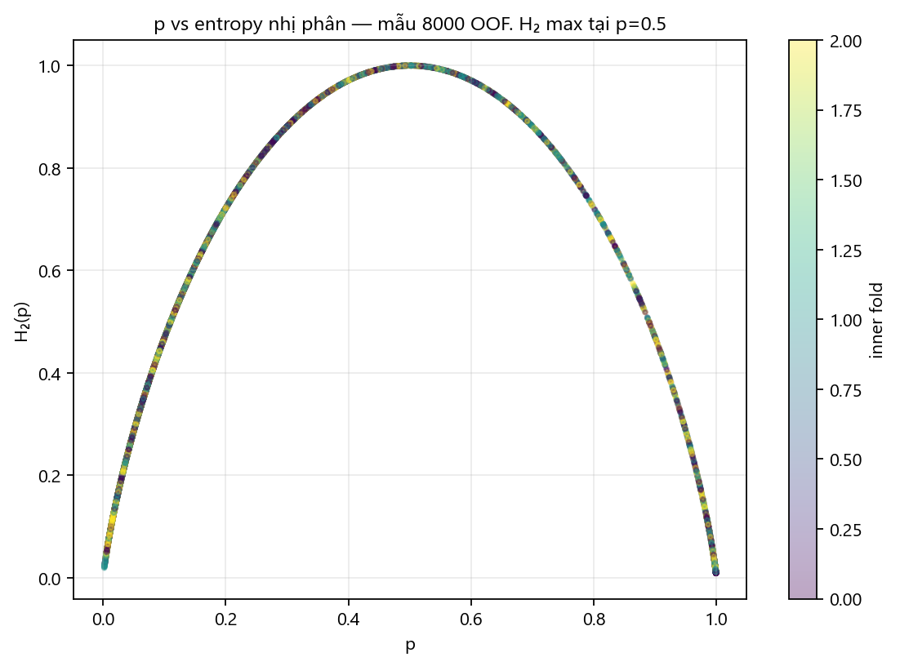

**Hình 4.14.** `p` so với entropy nhị phân H₂ (mẫu 8 000 OOF).

**Nhận xét:**

Từ histogram, phân bố `p` của Hybrid dịch theo cutoff: 20% tập trung thấp hơn 75%, cùng hướng với AP tăng ở mục 4.2.3. Đường đứt là median `t` của mốc. Hình `p`–H₂ cho thấy entropy cao quanh p = 0.5 — đúng vùng Recommendation V chuyển HUMAN_REVIEW khi H₂ > 0.70 hoặc (p − t) < 0.05. Cùng một `p` có thể cho ŷ khác nhau giữa các fold vì `t` fold-specific (Hình 4.2). Không nội suy “tách lớp hoàn hảo” từ histogram không nhãn.

### 4.2.5. Trọng số cổng theo cutoff (XAI)

`last_diagnostics['gate_weights']` được gộp theo mốc trên 9 run L1. Đây là bằng chứng thực nghiệm cho luận điểm hybrid: cổng học khi nào dùng nhánh nào. Không phải SHAP từng điểm.

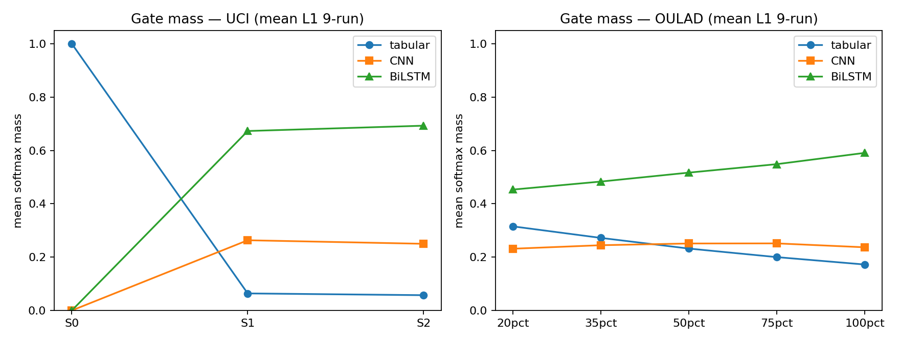

**Hình 4.15.** Mass softmax trung bình: tabular / CNN / BiLSTM theo mốc.

| dataset | stage | tabular | CNN | BiLSTM |
|---|---|---:|---:|---:|
| UCI | S0 | 1.000 | 0.000 | 0.000 |
| UCI | S1 | 0.064 | 0.263 | 0.673 |
| UCI | S2 | 0.057 | 0.250 | 0.693 |
| OULAD | 20% | 0.315 | 0.232 | 0.453 |
| OULAD | 35% | 0.272 | 0.245 | 0.483 |
| OULAD | 50% | 0.232 | 0.251 | 0.517 |
| OULAD | 75% | 0.200 | 0.251 | 0.549 |
| OULAD | 100% | 0.172 | 0.237 | 0.591 |

**Bảng 4.6.** Mass cổng (L1_control, trung bình 9 run).

**Nhận xét:**

UCI S0: tabular = 1 — CNN/BiLSTM tắt đúng thiết kế Chương 3. Khi có G1/G2, mass dồn sang BiLSTM (~0.67–0.69). OULAD: tabular giảm 0.315 → 0.172 khi cutoff tăng; BiLSTM tăng 0.453 → 0.591. CNN ổn định ~0.23–0.25. Cổng **không** sụp về một nhánh trên OULAD, nhưng BiLSTM chiếm phần lớn khi chuỗi đủ dài. Đây là kiểm chứng H3.

---

## 4.3. Recommendation V

Để đưa xác suất Hybrid thành hành động khả thi, Recommendation V được đánh giá trên Panel C held-out. Module đọc đúng `PredictionResult`, không tune trên Panel C, không ước lượng ATE.

### 4.3.1. Tổng quan Panel C

Panel C: 632 case, 150 sinh viên, 2 398 review, 0 abstain. Bốn trạng thái phát hành: `RECOMMEND`, `HUMAN_REVIEW`, `INSUFFICIENT_EVIDENCE`, `NO_FEASIBLE_ACTION`.

### 4.3.2. Chỉ số xếp hạng

| | NDCG@3 | P@1 | MRR | R@3 | invalid | unique Top-1 |
|---|---:|---:|---:|---:|---:|---:|
| Recommendation V | **0.88785** | **0.99206** | 0.99603 | 0.79947 | **0** | **5** |
| B1 (so sánh ranking) | 0.86649 | 0.99683 | 0.99841 | 0.80357 | 0 | 4 |
| B0 (so sánh ranking) | 0.81889 | 0.99365 | 0.99683 | 0.78981 | 0 | 2 |

**Bảng 4.7.** Panel C held-out, 632 case. Δ NDCG@3 Recommendation V so với B1: **+0.02131**, bootstrap 2000, 95% CI **[0.01440, 0.02815]**. So với B0: +0.06885, 95% CI **[0.06051, 0.07748]**.

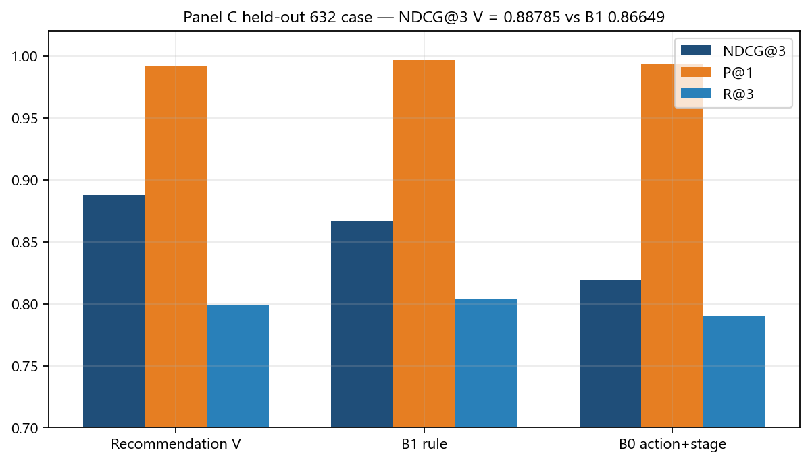

**Hình 4.16.** NDCG@3 / P@1 / R@3 trên Panel C.

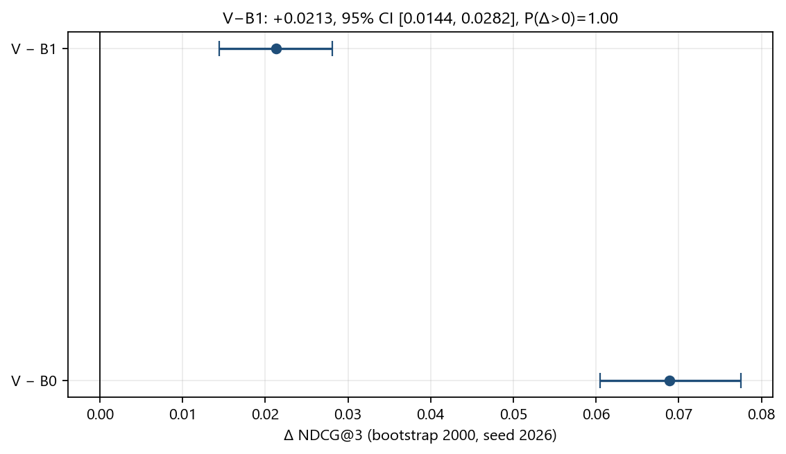

**Hình 4.17.** Bootstrap 2000, đơn vị query, Δ NDCG@3 của Recommendation V.

### 4.3.3. Định tuyến và Top-1

Trên 632 case: RECOMMEND **94 (14.9%)**, HUMAN_REVIEW **175 (27.7%)**, INSUFFICIENT_EVIDENCE **363 (57.4%)**, NO_FEASIBLE_ACTION **0**.

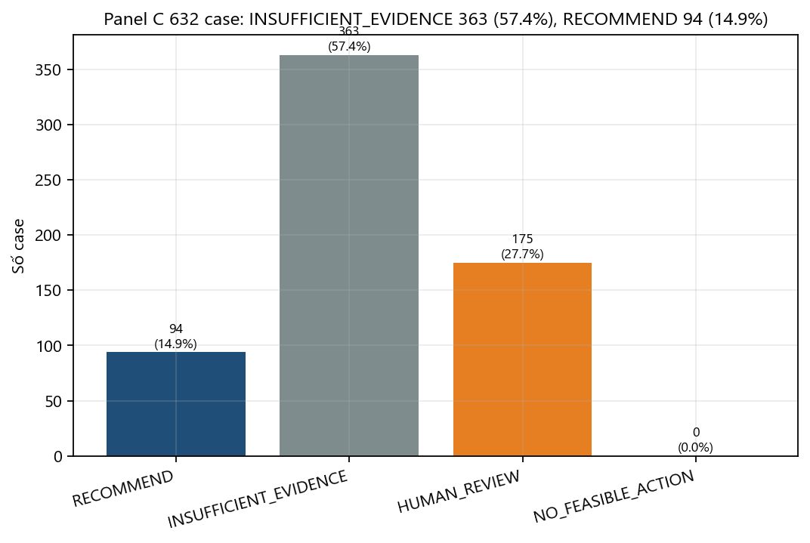

**Hình 4.18.** Phân bố trạng thái định tuyến trên Panel C.

Top-1: RECOVER_ENGAGEMENT 111, QUIZ_RETRIEVAL_PRACTICE 64, TARGETED_CONTENT_REVIEW 36, STUDY_REGULARITY 31, ASSESSMENT_COMPLETION 27.

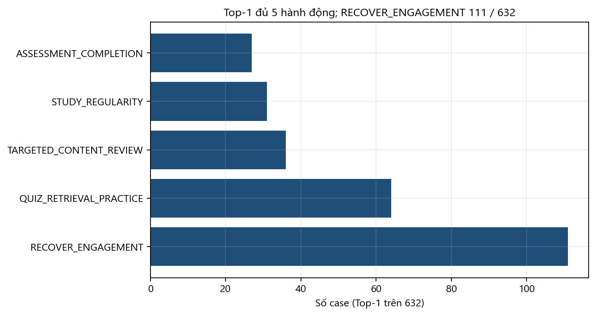

**Hình 4.19.** Phân bố hành động Top-1 — đủ năm hành động.

**Nhận xét:**

Recommendation V đạt NDCG@3 0.88785 và invalid-action 0 trên 632 case, phủ đủ năm hành động. 57.4% INSUFFICIENT_EVIDENCE là cơ chế an toàn khi thiếu bằng chứng VLE/assessment hoặc `p` dưới `t` của Hybrid — không phải lỗi xếp hạng. Không viết can thiệp làm thay `final_result`. 100% không vào Recommendation V.

### 4.3.4. Đọc kết quả đã khóa trên PostgreSQL

Đề tài **không** xây app/API giao diện. CLI chỉ đọc kết quả mô hình đã materialize.

| Bảng | Số dòng |
|---|---:|
| `raw.student_mat` / `student_por` | 395 / 649 |
| `catalog.student` / `enrollment` | 29 447 / 33 621 |
| `prediction.prediction` | 66 685 |
| `recommendation.recommendation` / `_item` | 8 179 / 23 226 |

**Bảng 4.8.** Quy mô chuỗi PostgreSQL bản phục vụ (không copy `studentVle`).

Ví dụ một enrollment: sinh viên `OULAD:631334`, CCC 2014B, mốc 20% — Hybrid `p = 0.2578`, `t = 0.18`, `ŷ = 1`, H₂ = 0.823 → Recommendation V **HUMAN_REVIEW**. Không train lại.

```text
python project.py db predict --student 631334 --course CCC --presentation 2014B --stage 20
python project.py db recommend --student 631334 --course CCC --presentation 2014B --stage 20
```
