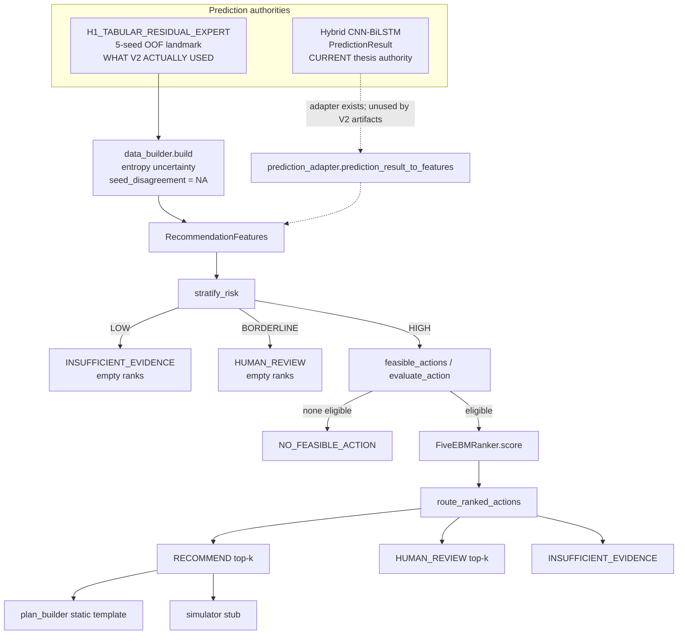

# Architecture and call graph

Authority on `main`: `src/recommend_hybrid/final/` (exported as `RecommendationPipeline`).

## System diagram



## Function-level call graph (runtime)

```text
ExplainableRecommendationPipeline.recommend(features)
  stratify_risk(features, RiskThresholds)
  if LOW: return Decision(INSUFFICIENT_EVIDENCE, ranked=())
  if BORDERLINE: return Decision(HUMAN_REVIEW, ranked=())
  feasible_actions(features)
    for action in CanonicalAction:
      evaluate_action
        contraindication set check
        evaluate_action_eligibility(DEFAULT_V2_POLICY)
  if no eligible: return Decision(NO_FEASIBLE_ACTION)
  ranker.score(features, eligible)   # FiveEBMRanker
    feature_frame(FEATURE_COLUMNS)
    model.predict → clip to [0,3] → /3 → [0,1]
  route_ranked_actions(features, ranked, SafetyThresholds)
  if route in {RECOMMEND, HUMAN_REVIEW}: ranked[:top_k] else ()
```

Note: after HIGH, `HUMAN_REVIEW` *can* carry top-k. The empty-rank HUMAN_REVIEW path is the **pre-feasibility BORDERLINE short-circuit**.

## Training / freeze graph (historical; do not rerun)

```text
landmark_rows.parquet (H1 OOF)
  data_builder → learner_stage_features
  query_evidence → assessment/VLE fields
  sampling (300/150, seed 2026, student-disjoint)
  Gemini external reviews (Panel A then later Panel B)
  weak_labels.fit_label_model per outer fold
  FiveEBMRanker OOF then final fit
  calibration considered, rejected
  router grid on Panel A
  development freeze
  Panel B one-shot
  FINAL_RELEASE_MANIFEST
```

On `main`, the middle artifacts (`explainable_v2/data`, `causal/input`) were **not copied** (`MIGRATION_MANIFEST.development_experiment_paths_copied_to_main=false`). Rebuild is blocked without `17b519b`.

## Dual contract surfaces

| Surface | Role |
|---|---|
| `src/recommend_hybrid/contracts.py` | Foundation: `Stage`, `PredictionContext` (H1-shaped), unused `StudentRepresentation` |
| `src/recommend_hybrid/final/contracts.py` | V2 runtime: `RecommendationFeatures`, `CanonicalAction`, `RouteStatus` |
| `src/prediction/contracts.py` | Current prediction: `PredictionResult` C0 |

V3 must treat the last as the only live prediction contract.
